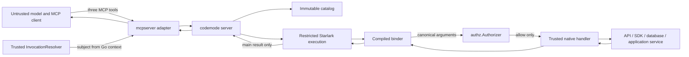

# CodeMode Architecture

## Problem

CodeMode is a Go framework for authoring **new, code-native MCP servers**. A server author registers native Go capabilities backed directly by application services, SDKs, databases, and protocols. CodeMode exposes those capabilities to a model as a generated Starlark SDK behind three MCP tools:

- `search_api`
- `describe_api`
- `execute`

CodeMode is not an MCP client, proxy, importer, translator, or compatibility layer. It never connects to or invokes downstream MCP servers. MCP exists only at the client boundary.

The central design problem is keeping discovery compact while preserving a strict native boundary. Registration, generated signatures, runtime binding, deployment filtering, authorization, handler dispatch, and result conversion must agree about each capability. Untrusted Starlark must not gain ambient access to the host. Authentication and credential selection must remain in trusted Go code.

The repository is currently a Go application template: its module name, template CLI, Cobra/Viper packages, and binary/image release configuration do not describe this product. The first implementation replaces that scaffold with a library-oriented layout rather than adapting the template CLI into a generic CodeMode server.

## Goals

- Expose a small, stable MCP surface while allowing progressive API discovery.
- Let one Starlark program compose multiple native calls with ordinary namespaced functions, branches, loops, and data flow.
- Make typed capability registration the single source of truth for discovery, signatures, binding, authorization identity, and dispatch.
- Keep authenticated identity and credentials in trusted Go code and out of Starlark values.
- Remove deployment-disabled capabilities from discovery, description, and execution together.
- Authorize every valid native invocation after canonical keyword decoding and before its Go handler or side effect.
- Fail closed when authorization denies, errors, times out, or panics.
- Give every execution a fresh, restricted, bounded Starlark thread.
- Keep the initial implementation small enough to learn from working behavior.

## Non-goals

- Importing, proxying, translating, or invoking downstream MCP servers.
- Exposing one MCP tool per capability.
- Exposing `call_tool(name, params)`, raw HTTP, generic SQL, SDK clients, filesystem access, environment access, shell commands, or subprocesses to Starlark.
- Implementing authentication providers, OAuth flows, a secret store, or credential brokering.
- Authorizing by inspecting Starlark source.
- Supporting Starlark `load`, user modules, dynamic code loading, or arbitrary Python packages.
- Supporting arbitrary Go values, all JSON Schema features, or a public codec extension framework in the first release.
- Streaming or returning intermediate native-call results through MCP.
- Automatically retrying generic capability calls. A focused native adapter owns protocol-aware retry, idempotency, and backoff.
- Claiming hard memory isolation or hostile multi-tenant process isolation from an in-process interpreter.
- Shipping a generic CodeMode binary whose capabilities are selected at runtime. A consuming application compiles its native capabilities into its own server.

## Terminology

| Term | Meaning |
|---|---|
| **Capability** | A registered native Go operation with metadata, typed input and output, a stable identity, and a handler. |
| **Capability ID** | Stable, opaque identity used for authorization and audit. Renaming the model-facing function does not implicitly change it. |
| **Capability name** | Dotted model-facing Starlark name, such as `github.list_repos`. |
| **Catalog** | The immutable, deployment-filtered set of built capabilities. |
| **Subject** | Trusted, non-secret authenticated identity resolved from Go context. |
| **Execution** | One `execute` call, using one fresh Starlark thread and one set of budgets. |
| **Invocation** | One native capability call made by a running program. |
| **Binder** | The restricted type plan that decodes keyword arguments, produces authorization arguments, converts results, and renders the signature. |
| **Native handler** | Trusted Go code that calls an application service, SDK, database port, or protocol adapter. |
| **Deployment filter** | Static startup configuration that removes capabilities before the catalog becomes usable. |
| **Authorizer** | Engine-neutral Go port called for every valid invocation before handler dispatch. |

## Settled invariants

1. The only MCP tools are `search_api`, `describe_api`, and `execute`.
2. CodeMode never opens or proxies a downstream MCP session.
3. A capability is either present in search, exact description, and runtime bindings, or absent from all three.
4. Every capability has one unique stable `CapabilityID` and one unique model-facing `CapabilityName`. Duplicate IDs, names, or namespace/function collisions fail the build.
5. Programs call ordinary, pre-bound namespaced functions. There is no dynamic function that accepts a capability or tool name.
6. Capability calls are keyword-only in the initial contract.
7. The binder rejects positional arguments, missing required fields, duplicate or unknown keywords, unsupported values, and invalid nesting before authorization and dispatch.
8. The canonical authorization arguments and typed handler input come from the same compiled field plan. No defaulting or argument transformation occurs after authorization.
9. Every valid invocation is authorized after canonical decoding and before its handler runs. A denial or policy failure results in zero handler calls.
10. The required `Authorizer` fails closed. An unrestricted deployment must choose `authz.AllowAll` explicitly; a missing authorizer is a build error.
11. The authenticated subject is resolved only from trusted Go context. Tool arguments, source code, MCP client self-description, and `_meta` cannot select a subject.
12. Credentials, tokens, raw headers, credential selectors, and clients never enter Starlark, authorization arguments, discovery output, or MCP results.
13. Each execution receives a fresh Starlark thread and fresh budgets. No mutable program state is shared between executions.
14. Capability calls are disabled while module top-level code is loading. They become available only while the required zero-argument `main()` and its helpers are running.
15. Starlark receives no filesystem, environment, network, subprocess, credential, SDK-client, reflection, unsafe, or module-loading capability.
16. Only the value returned by `main()` crosses the MCP boundary. Prints and intermediate values are not returned or logged by the framework.
17. The catalog is immutable after `Build`; the first implementation has no hot registration or catalog reload.
18. The framework performs no automatic generic retry. A timeout does not prove that an external side effect stopped.
19. Public errors never expose credentials, raw source, arguments, results, SDK payloads, policy details, or Go stack traces.
20. In-process Starlark provides restricted capabilities and bounded accounting, not a hard heap ceiling or process boundary.

## Trust boundaries and data flow



### Untrusted data

The MCP envelope, meta-tool inputs, Starlark source and values, capability arguments, and external-service results are untrusted. Registration metadata and application code are trusted but still validated at build time where possible.

Native handlers are part of the trusted computing base. CodeMode can prevent Starlark from obtaining ambient authority, but it cannot prevent a malicious registered handler from leaking a secret or ignoring cancellation.

### Authentication and credential path

For HTTP, host middleware authenticates the request and places typed identity and any request-scoped credential selection in `context.Context`. For stdio, the host supplies an explicit fixed or process-derived resolver. `mcpserver.InvocationResolver` reads only that trusted context and returns a non-secret `authz.Subject`.

The original context continues through authorization and handler dispatch. A closed-over application service or client factory may use it to choose credentials. CodeMode copies only the subject into authorization input. It never serializes credentials or credential selectors.

All three meta-tools resolve the subject before doing work. Discovery is deployment-visible rather than subject-filtered in the initial contract: authentication gates access, the static deployment filter controls catalog visibility, and per-invocation authorization controls native effects.

### Startup

1. The host creates a builder with an authorizer, static disabled-capability configuration, and execution limits.
2. The host registers typed native capabilities.
3. `Build` validates metadata and collisions, compiles binders, applies deployment filtering, and creates the immutable catalog.
4. A filter error or reference to an unknown configured capability fails the build. There is no partially usable server.
5. `mcpserver.New` binds the built server and an `InvocationResolver` to the official MCP Go SDK and registers exactly the three meta-tools.

### Discovery

`search_api` scans the immutable enabled slice using only capability name and summary. Results are compact `{name, signature, summary}` records in deterministic order. `describe_api` performs exact lookup and returns the generated compact reference for one exact name. Neither path reflects over Go types per request.

Disabled capabilities have no catalog entry, search record, description, namespace, or callable builtin.

### Execution

1. `mcpserver` validates the `execute` request and resolves the trusted subject.
2. The server rejects source that exceeds its configured source budget.
3. `internal/execution` creates a fresh thread, connects request cancellation, installs the enabled namespaces, rejects `load`, and applies execution budgets.
4. Module code runs in the **loading** phase. A capability builtin called in this phase fails without calling the authorizer or handler.
5. The runtime requires one callable `main()` with no parameters, switches to the **running** phase, and calls it.
6. Each native invocation follows the ordering below.
7. The runtime converts and bounds the value returned by `main()`.
8. MCP returns only `{"result": <final value>}`.

### Native invocation ordering

1. Verify that execution is in the running phase.
2. Charge the native-call attempt budget.
3. Reject positional arguments.
4. Decode and validate keywords with the capability’s compiled binder.
5. Produce both typed Go input and the canonical authorization projection from that same plan.
6. Construct `authz.AuthorizationInput` from the trusted subject, stable capability ID and name, and canonical arguments.
7. Call `Authorizer.Authorize` under the execution context.
8. On any denial, error, cancellation, timeout, or recovered authorizer panic, return a safe failure and do not call the handler.
9. On allow, call the registered typed handler directly with the same subject and request-derived context.
10. Convert the handler result through the compiled output plan before returning a Starlark value.

The executor does not wrap a handler in a detached timeout goroutine. Returning while a side effect continues would provide a false cancellation guarantee and leak work.

## Package structure

The initial implementation has six substantive packages. These boundaries reflect distinct vocabularies, invariants, and reasons to change without creating speculative ports.

```text
.
├── doc.go
├── builder.go
├── capability.go
├── limits.go
├── errors.go
├── server.go                         # package codemode
├── authz/
│   ├── doc.go
│   ├── authz.go
│   └── mocks/                        # mockery-generated Authorizer mock
├── mcpserver/
│   ├── doc.go
│   ├── server.go
│   ├── resolver.go
│   ├── service.go
│   └── mocks/                        # generated resolver/service mocks
└── internal/
    ├── binding/
    │   ├── doc.go
    │   ├── plan.go
    │   ├── input.go
    │   ├── output.go
    │   └── signature.go
    ├── catalog/
    │   ├── doc.go
    │   ├── build.go
    │   ├── catalog.go
    │   └── search.go
    └── execution/
        ├── doc.go
        ├── execute.go
        ├── phase.go
        └── limits.go
```

### Responsibilities

#### Root `codemode`

The thin public facade owns capability registration, builder state, server construction, minimal typed options and limits, and safe public errors. `Register` erases the generic handler only after compiling its concrete input and output plans. `Build` returns an immutable, concurrency-safe server.

The root package does not read flags, files, or environment variables. It does not own transport shutdown or background services.

#### Public `authz`

`authz` defines only the non-secret `Subject`, `AuthorizationInput`, `Authorizer`, denial representation, and explicit `AllowAll`. It has no Starlark, MCP, OPA, logging, or network dependency.

This package is the stable policy-engine-neutral boundary. Its input starts deliberately small and grows only when a real Go authorizer proves another trusted field is required.

#### `mcpserver`

`mcpserver` is the real inbound adapter for the official MCP Go SDK. It defines the adapter-owned narrow `Service` interface implemented by `*codemode.Server` and the trusted `InvocationResolver` port. It owns MCP request validation, tool registration, and safe projection of errors into tool results.

It does not authenticate requests itself, implement transport middleware, expose capability-specific MCP tools, or manage framework-wide shutdown.

#### `internal/binding`

`binding` compiles the supported Go type subset into reusable input and output plans. The same input plan:

- renders the compact keyword-only Starlark signature;
- validates keyword names and requiredness;
- converts Starlark values directly to typed Go values;
- produces the canonical JSON-shaped authorization projection.

The output plan converts typed handler results to bounded Starlark values and the final Starlark result to MCP-safe data. There is no public canonical value package, public `Codec[T]`, capability JSON Schema generator, separate runtime schema validator, or broad validation-tag language.

#### `internal/catalog`

`catalog` validates ID, name, and namespace collisions; applies the static deployment filter; and stores the enabled capabilities in copied immutable maps and a deterministic slice. Exact lookup uses the map. Search linearly scans name and summary in the slice.

The catalog owns no weighted index, cache contract, digest, keyword system, generated examples, or namespace prototype cache.

#### `internal/execution`

`execution` owns the Starlark lifecycle, loading/running phase guard, fresh thread, disabled module loading, request cancellation, minimal budgets, per-call authorization, direct handler dispatch, and final-result extraction.

It does not define runner, invoker, or erased-handler interfaces merely to split implementation files. A second implementation must exist before such an internal port is introduced.

### Dependency direction

```text
mcpserver ──> codemode ──> authz
    │             │
    └────────────>│
                  ├──> internal/execution ──> internal/catalog ──> internal/binding
                  │              └──────────────────────────────> internal/binding
                  └─────────────────────────────────────────────> internal/catalog
```

`authz` has no framework dependency. Internal packages never import `mcpserver`. `mcpserver` owns the service interface it consumes; the root package returns concrete builders and servers. The only initial interfaces are real ports with independent implementations or composition owners:

- `authz.Authorizer`
- `mcpserver.InvocationResolver`
- `mcpserver.Service`

Mocks are generated only for those interfaces. Handler function values and concrete internal components do not acquire interfaces solely for testing.

### Repository cutover

Implementation starts with a clean cutover:

- rename the module from `github.com/meigma/template-go` to `github.com/meigma/codemode`;
- remove `cmd/template-go`, `internal/cli`, `internal/config`, and `internal/templateinfo` rather than adapting them;
- remove binary and image publication configuration unless a separately approved first-party server later creates that need;
- revise Moon and CI tasks for a Go library, its tests, linting, and actual MCP end-to-end scenario;
- replace template-facing README and documentation only with behavior that exists.

`AGENTS.md` remains authoritative: every package has `doc.go`, every Go declaration and struct field has Godoc, source files remain below the repository cap, and user-visible documentation lives under `docs/` in Plain Language and Diátaxis form.

## Minimal public API direction

The exact spelling may adjust while the first slice is compiled, but the boundary stays this small:

```go
builder := codemode.New(codemode.Options{
    Authorizer: authz.AllowAll(), // Explicit; nil is never treated as allow.
    DisabledCapabilities: []codemode.CapabilityID{
        "github.repositories.delete",
    },
    Limits: codemode.DefaultLimits(),
})

err := codemode.Register(builder, codemode.Capability[ListReposInput, []Repository]{
    ID:          "github.repositories.list",
    Name:        "github.list_repos",
    Summary:     "List repositories in an organization.",
    Description: "Returns repositories visible to the authenticated subject.",
    Handler: func(
        ctx context.Context,
        subject authz.Subject,
        input ListReposInput,
    ) ([]Repository, error) {
        return repositories.List(ctx, subject, input)
    },
})
if err != nil {
    return err
}

server, err := builder.Build()
if err != nil {
    return err
}

adapter, err := mcpserver.New(server, invocationResolver)
```

The important contract is:

- `Register` is a generic function because Go methods cannot add type parameters;
- the mutable builder is single-threaded and ends at `Build`;
- the returned server is immutable and safe for concurrent MCP calls;
- handlers receive standard context, the same trusted non-secret subject used for authorization, and typed input;
- handlers never receive MCP requests, raw JSON, Starlark values, threads, credentials, or dynamically selected tool names;
- a static disabled list is data, not a speculative filtering interface;
- explicit `authz.AllowAll()` makes an intentionally unrestricted deployment reviewable.

A minimal authorization boundary is conceptually:

```go
type Subject struct {
    ID string
}

type AuthorizationInput struct {
    Subject        Subject
    CapabilityID   string
    CapabilityName string
    Arguments      map[string]any
}

type Authorizer interface {
    Authorize(context.Context, AuthorizationInput) error
}
```

`Arguments` contains a fresh, canonical JSON-shaped projection from the binder: null, Boolean, string, signed integer, finite float, lists, and string-keyed objects. It is not a public framework value hierarchy. A recognized denial is distinct from an authorizer failure; both prevent dispatch, while only the safe classification crosses MCP.

## Capability and binding contract

### Registration

A capability supplies a stable ID, dotted Starlark name, summary, description, and typed handler. Registration copies retained metadata and rejects empty or malformed identifiers, invalid names, nil handlers, unsupported types, and obvious duplicates. `Build` performs whole-catalog and namespace collision checks.

Capability names consist of Starlark identifier segments separated by dots. The final segment is the function; preceding segments form immutable namespaces. A function cannot also be a namespace.

Calling `Register` after `Build` fails and never mutates the live server.

### Restricted type plan

The first binder supports only the types required by the first real capabilities, beginning with:

- non-pointer structs as capability inputs;
- Boolean, string, fixed-width signed integer, and finite float fields;
- pointers for optional fields;
- nested structs and bounded lists when the first slice needs them;
- corresponding result structures;
- `json` field names where they map to valid Starlark identifiers.

Non-pointer input fields are required. Pointer fields are optional. Omission and explicit `None` normalize identically to a nil pointer and an absent canonical key. The framework applies no defaults. Unknown tags or unsupported Go types fail registration rather than being ignored or routed through `any`.

Input is keyword-only. A generated signature is compact and comes directly from the runtime plan:

```text
github.list_repos(*, org: str, limit: int | None) -> list[Repository]
```

The notation is model documentation, not executable annotation syntax.

The binder converts directly between Starlark and typed Go values; it does not marshal through JSON on every invocation. It produces authorization arguments during the same traversal. This removes schema/decoder drift without introducing dual schema-generation and validation dependencies.

### Result conversion

Handler results can re-enter Starlark only as supported scalars, lists, and string-keyed objects. The final `main()` value is independently checked for supported types, nesting depth, and configured result size before MCP serialization. Functions, builtins, namespaces, non-string dictionary keys, non-finite floats, out-of-range integers, cycles, channels, SDK objects, and Go pointers do not cross the boundary.

## MCP boundary contract

### `search_api`

Input is a bounded query string. The catalog performs a deterministic case-normalized linear scan of enabled capability names and summaries. Output is a bounded list of compact records:

```json
{"name": "github.list_repos", "signature": "...", "summary": "..."}
```

There are no keywords, weights, embeddings, external search service, or cache contract initially.

### `describe_api`

Input is one exact capability name. Output is its name, compact signature, summary, description, and supported input/output shape. Missing and disabled names return the same safe not-found classification. Description does not perform fuzzy expansion.

### `execute`

Input is one bounded Starlark program. It has no caller-controlled subject, credential, module path, capability allow-list, timeout, or budget fields. Successful output contains only the final result:

```json
{"result": <supported value>}
```

Valid MCP tool calls whose program, authorization, handler, or budget fails return safe MCP tool errors. Malformed protocol envelopes remain protocol errors. The adapter follows the selected official SDK version rather than recreating MCP transport semantics.

## Authentication and authorization

### Invocation resolution

`mcpserver.InvocationResolver` is a required host adapter:

```text
Resolve(context.Context) -> authz.Subject or error
```

It reads identity established by trusted middleware or process composition. It never derives identity from program data. Resolver failure stops the request before discovery or execution.

`Subject` starts with the minimum stable identity needed by the first policy. Tenant, issuer, roles, and trusted attributes are not frozen into a speculative versioned domain. They are added only when a real application authorizer demonstrates the need and their credential-exclusion rules are defined.

### Static deployment filtering

Filtering runs once during `Build`. The initial public configuration names capabilities to disable; it is not a callback or policy engine. The build rejects unknown configured IDs and creates a new catalog containing only enabled entries. Changing deployment visibility means constructing and deploying a new server.

### Per-invocation authorization

`authz.Authorizer` is mandatory and called once for every valid native invocation. Its initial input contains:

- the trusted non-secret subject;
- stable capability ID;
- model-facing capability name;
- canonical, validated keyword arguments.

It excludes source, raw MCP data, transport headers, credentials, clients, intermediate values, and handler results. The contract is intentionally not labeled `codemode.authz/v1` before a real authorizer proves that it is sufficient.

A recognized denial and every authorizer failure fail closed. The execution layer recovers an authorizer panic as policy failure. Denial reasons remain trusted diagnostic data and are not copied verbatim into model-facing errors. The framework does not cache decisions and does not retry an authorizer or handler automatically.

The first vertical slice must include a denial test that observes **zero handler side effects**. Authorization is not a later hardening stage.

### Rego

Rego is not an initial dependency or package. A Go `Authorizer` proves the input contract first. An optional Rego adapter is justified only when a real consumer needs Rego and the required input has stabilized. It must remain outside the core dependency path, prepare policy before serving, restrict unsafe builtins, and preserve fail-closed behavior.

## Execution safety and containment

### Restricted interpreter

Every `execute` call creates a fresh Starlark-Go thread. Only pure language operations and immutable namespaces for enabled capabilities are installed. `load` is rejected. No filesystem, environment, network, subprocess, credential, client, module loader, or dynamic builtin factory is present.

Top-level evaluation and `main()` are separate phases. The capability builtins consult execution-owned phase state, so a top-level call cannot bypass the guard through a helper. `main()` must exist, be callable, and take no arguments. Helpers called from `main()` share the running phase and the same budgets.

Program printing has no framework channel: it is discarded or unavailable, never returned in MCP output, and never forwarded to default logs.

### Minimal budgets

The first implementation has configurable, non-zero limits for:

- source size;
- Starlark execution steps;
- elapsed execution time;
- attempted native calls;
- converted-value nesting depth;
- final result size.

Defaults are development hypotheses, not production claims. Zero does not silently mean unlimited. The request context and execution deadline flow into authorizer and handler calls. Budget accounting uses checked counters. Raising a limit is an explicit host decision.

The initial core does not add speculative queueing, admission protocols, per-namespace quotas, print budgets, or arbitrary concurrency controls. The host transport and deployment own request concurrency until measurement shows a framework-level control is needed.

### Cancellation limitations

Thread cancellation is observed between Starlark steps. A Go builtin can delay it while blocked in an authorizer or handler. CodeMode passes cancellation to both but cannot safely preempt them or prove that a timed-out side effect stopped. Native adapters must use context-aware operations and bounded clients.

### Honest containment

Step, time, call, depth, and result limits reduce exposure but do not impose a hard heap ceiling. Starlark-Go has no supported per-thread allocator budget, and an in-process interpreter shares the host process. A large allocation can occur before conversion rejects its value.

Before claiming suitability for mutually untrusted tenants, an adversarial workload must measure large comprehensions and collections, repeated executions, cancellation loops, large native results, and blocked test handlers. The decision record must include peak and retained heap, RSS trend, cancellation behavior, goroutine stability, and the target deployment’s threat model.

A supervised worker process is introduced only if those measurements are unacceptable or the deployment requires a hard tenant memory/process boundary. No fixed MiB, percentile, or run-count threshold is part of this architecture; the production environment and measured baseline define the gate.

## Errors and lifecycle

### Safe errors

The first public taxonomy stays small:

- invalid registration or build;
- unauthenticated;
- not found;
- invalid program or arguments;
- permission denied or policy failure;
- resource limit or deadline;
- capability failure;
- internal failure.

Sentinel or typed errors exist only where callers need control flow. The trusted cause may be wrapped for host diagnostics, but the MCP projection contains a stable coarse classification, bounded safe message, and optional capability name or Starlark location. It excludes source excerpts, arguments, results, credentials, headers, SDK bodies, policy documents, denial reasons, and Go stacks.

A handler error is opaque by default. The framework recovers panics at authorizer, handler, interpreter, and MCP boundaries to preserve availability, but recovery cannot roll back a side effect.

### Failure behavior

| Failure | Behavior |
|---|---|
| Invalid registration, unsupported type, duplicate ID/name, or namespace collision | `Register` or `Build` fails; no server is returned. |
| Unknown disabled capability | Build fails closed. |
| Resolver failure | Request fails unauthenticated before catalog or execution work. |
| Search miss | Empty result list. |
| Exact description miss | Safe not-found error. |
| Parse failure, missing or invalid `main`, or top-level capability call | Invalid-program error; no native handler runs for the rejected call. |
| Invalid capability arguments | Invalid-arguments error; authorizer and handler are not called. |
| Policy deny, error, timeout, cancellation, or panic | Safe denial/policy failure; handler is not called. |
| Handler error or panic | Safe capability/internal failure; no automatic retry or rollback claim. |
| Step, time, call, depth, or final-result limit | Execution stops with a safe limit/deadline error. |
| Handler ignores context | Request or shutdown may remain blocked; the limitation is not hidden. |
| Unsupported handler or final result | Value does not cross into Starlark or MCP. |

### Lifecycle and concurrency

The builder is mutable, single-threaded, and one-shot. `Build` closes registration. The server shares only the immutable catalog and compiled plans; every execution has its own context, thread, phase, and counters.

The consuming host and official MCP SDK own listeners, sessions, signal handling, and graceful transport shutdown. CodeMode exposes no framework shutdown choreography and starts no catalog-refresh or policy-refresh goroutines. Request cancellation flows into active executions. Registered handlers and authorizers must be safe for the concurrency permitted by the host.

## Dependencies

| Dependency | Initial purpose | Boundary |
|---|---|---|
| Go standard library | Context, reflection, encoding, synchronization, and errors | Preferred throughout. |
| Starlark-Go | Restricted interpreter | Used by `internal/binding` and `internal/execution`; pin a reviewed version. |
| Official MCP Go SDK | Three-tool inbound adapter and actual MCP tests | Isolated in `mcpserver`; pin a reviewed v1 release. |
| Mockery | Generated mocks for actual interfaces | Development dependency only. |
| Testify, where already conventional | Behavior assertions | Test dependency only. |

The initial module does not depend on Cobra, Viper, OPA/Rego, JSON Schema generation or validation libraries, Testcontainers, an observability SDK, a search engine, or an IPC framework. A dependency is added only with a working consumer and a demonstrated need.

## Testing and documentation

Testing follows the repository’s required layers and defends observable contracts.

### Unit

- Capability ID/name validation and collision behavior.
- Restricted type-plan compilation and unsupported-type rejection.
- Keyword-only binding, required/optional behavior, unknown keywords, and canonical argument projection.
- Signature generation from the same plan used at runtime.
- Result conversion, depth enforcement, and final-result bounds.
- Static filtering, disabled-capability absence, exact lookup, and deterministic linear search.
- Execution phase transitions and budget accounting.
- Safe error projection and secret-field exclusion.

### Integration

- Real Starlark execution with a generated `Authorizer` mock proves canonical arguments, authorization ordering, fail-closed behavior, and zero handler calls after denial.
- Real execution covers helpers, loops, branches, multiple native calls, top-level-call rejection, missing or invalid `main`, disabled `load`, step/time/call limits, cancellation, and final-result-only behavior.
- The MCP adapter uses generated `Service` and `InvocationResolver` mocks to verify exactly three tools, resolver ordering, request/result mapping, and safe tool errors.
- Static filtering is exercised across search, description, and runtime binding in one contract test.

### Actual MCP end to end

The first slice includes a compiled native test server and an official MCP client using a real supported transport. The scenario must:

1. search and describe an enabled capability;
2. execute one program that makes multiple native calls and returns one final result;
3. prove a disabled capability is absent from all three surfaces;
4. execute as a denied subject and prove a side-effect counter remains unchanged;
5. carry a credential canary in trusted context and prove it is absent from Starlark globals, discovery, description, authorization arguments, default errors, and MCP results;
6. exercise cancellation against a cooperative native handler.

The first end-to-end capability may use a deterministic in-process application service. Testcontainers is added only when a real capability needs a live external service. Broad fuzzing begins only after binder contracts stabilize. Benchmarks are written only for measured questions. The race detector covers concurrency-sensitive packages and the actual MCP scenario.

Every package has `doc.go`. Every function, type, and struct field receives Godoc, including unexported declarations. Public API boundaries receive fuller examples where useful. User documentation is added under `docs/` only for shipped behavior; no empty documentation hierarchy is created in advance.

## Tradeoffs and rejected alternatives

| Alternative | Decision |
|---|---|
| One MCP tool per native capability | Rejected because it expands model context and round trips. |
| Downstream MCP proxy/import layer | Rejected because it contradicts the native-capability trust boundary and creates another schema and authorization boundary. |
| Dynamic `call_tool`, raw HTTP, generic SQL, or SDK access | Rejected because untrusted code could select operations outside stable policy identity. |
| Authorization by source inspection | Rejected because helpers, control flow, and runtime arguments make it incomplete and bypassable. |
| Three-package collapse | Rejected because the facade, policy domain, MCP adapter, binding, catalog, and execution each have distinct contracts and dependency directions. |
| Separate `value`, `schema`, `reference`, `invoke`, `program`, and `starlark` packages | Deferred because the first implementation has no second implementation or independent consumer to justify them. |
| Public canonical values and `Codec[T]` | Deferred because they freeze a broad extension contract before real capabilities prove it. |
| Capability JSON Schema generation plus runtime schema recompilation | Rejected initially because the binder can supply signatures, validation, canonical arguments, and typed decoding from one plan without two dependencies. |
| Positional arguments | Rejected initially because keyword-only calls remove field-order compatibility and canonicalization complexity. |
| Weighted indexes, keywords, digests, and caches | Rejected initially because immutable maps, a slice, and linear name/summary search satisfy the first catalog. |
| Mandatory or first-slice Rego | Deferred until a Go authorizer proves the input contract and a consumer requires Rego. |
| Worker process for every execution | Deferred because IPC, lifecycle, and credential propagation are substantial; measurement or a hard-isolation requirement must trigger it. |
| Detached goroutine timeout around handlers | Rejected because it can return while a side effect continues. |
| Automatic generic retries | Rejected because they can duplicate non-idempotent effects. |
| Custom observer, print channel, framework shutdown, or admission framework | Deferred until operating evidence gives each one a concrete consumer. |

## Risks

| Risk | Consequence | Current mitigation |
|---|---|---|
| A trusted handler returns a credential | Secret reaches Starlark or MCP | Focused handlers, restricted outputs, credential-canary tests, and review. The framework cannot defend against malicious trusted Go code. |
| The authorizer sees arguments different from handler input | Authorization gap | One compiled binder traversal creates both values; no post-authorization defaults or transformations. |
| A handler ignores context | Cancellation and host shutdown can block | Require context-aware native adapters and bounded clients; document the limitation and use containment escalation where required. |
| Starlark allocates heavily before a limit is checked | Host memory pressure | Step/time/depth/result limits, adversarial measurement, host concurrency controls, and a worker-process evidence gate. |
| Capability ID changes accidentally | Policy outage or authorization gap | Explicit stable ID distinct from name, collision checks, contract tests, and release review. |
| Deployment filtering drifts across surfaces | Disabled operation remains discoverable or callable | One filtered immutable catalog feeds search, description, and namespace construction. |
| Metadata visibility is too broad | An authenticated subject learns a capability exists | Separate deployments now; add subject-specific visibility only from a demonstrated requirement. |
| Official MCP SDK or Starlark-Go changes | Boundary churn or semantic drift | Pin reviewed versions and isolate them in `mcpserver`, `binding`, and `execution`. |
| A model retries an uncertain side effect | Duplicate mutation | No framework retries; capability adapters own idempotency and safe retry semantics. |

## Evidence-gated decisions

Deferred work is not a backlog to implement automatically. Each item requires the stated evidence and a fresh architecture decision.

| Deferred decision | Evidence required before adding it |
|---|---|
| Broader binder types, tags, constraints, or custom codecs | At least one real capability cannot be expressed safely by the restricted plan. |
| Public canonical value domain | More than one public consumer needs stable value construction or inspection outside `authz.AuthorizationInput`. |
| JSON Schema generation or runtime validation library | A real machine-readable consumer needs capability schemas, or binder validation cannot express a required contract. |
| Rego adapter | A real deployment requires Rego and the Go authorizer has proved the authorization input fields and semantics. |
| Worker-process execution | Adversarial measurements are unacceptable, or the deployment threat model requires a hard tenant boundary. |
| Framework admission/concurrency control | Measured overload cannot be controlled adequately by the host transport or deployment. |
| Richer search | Representative discovery queries show repeatable failures that linear name/summary search cannot fix. |
| Subject-specific discovery policy | Capability existence is demonstrably sensitive within one deployment. |
| Rich subject or execution metadata | A real authorization rule cannot be expressed with the minimal trusted subject and capability arguments. |
| Structured safe handler errors | Real capabilities need model-actionable domain failures that cannot be represented safely as results. |
| Testcontainers | A real native capability needs a live service to defend its integration contract. |
| Fuzz suites | Binder and error contracts are stable enough that fuzz findings will defend a lasting boundary. |
| Benchmarks | A profile, latency target, allocation question, or containment decision identifies a specific measurement. |
| Custom observability port | Operators demonstrate required signals that cannot be obtained at the host, MCP, authorizer, or native-adapter boundary. |

## Open questions

These questions do not weaken the first slice and do not authorize speculative implementation:

- Which real capability first requires subject fields beyond an opaque stable ID?
- Which official MCP transport provides the smallest reliable actual end-to-end path for the first repository cutover?
- What deployment threat model and measured baseline will govern the in-process containment decision?
- Will real model workflows need machine-readable capability schemas beyond generated Starlark signatures and descriptions?

## Agile vertical-slice plan

### First slice: secure native capability end to end

The first mergeable product slice performs the repository cutover and ships one complete path rather than an unauthenticated scaffold:

- the six-package layout;
- stable `CapabilityID` and `CapabilityName`;
- typed registration and the restricted keyword-only binder;
- static deployment filtering and immutable catalog;
- deterministic linear search, exact description, and generated compact signatures;
- required trusted `InvocationResolver`;
- required fail-closed `Authorizer` with explicit `AllowAll`;
- denial before handler dispatch with zero observed side effects;
- fresh restricted Starlark execution, rejected `load`, loading/running phase guard, and zero-argument `main()`;
- source, step, time, call, depth, and final-result limits;
- direct typed handler dispatch and final-result-only MCP output;
- credential-canary evidence;
- unit, integration, and actual MCP end-to-end coverage of the entire path.

The slice is complete when an official MCP client can search, describe, and run one program containing multiple native calls; a denied subject produces no handler side effect; a disabled capability is absent everywhere; and the credential canary never crosses a boundary.

### Subsequent slices

After the first slice, work is selected from observed product needs:

1. Add real native capabilities one at a time and widen binding or error contracts only where they cannot be expressed safely.
2. Exercise real authentication middleware and focused credential-selecting services without changing the Starlark boundary.
3. Measure adversarial execution and record the in-process-versus-worker containment decision for the intended deployment.
4. Add Rego, richer search, schemas, live-service tests, observability, or admission controls only when their evidence gates are met.
5. Add user documentation alongside each shipped behavior and rehearse the library release path only when the public API is ready to publish.

Every slice preserves the same product: a native Go capability framework with three MCP meta-tools, per-invocation authorization, trusted credential isolation, restricted Starlark execution, and no downstream MCP behavior.