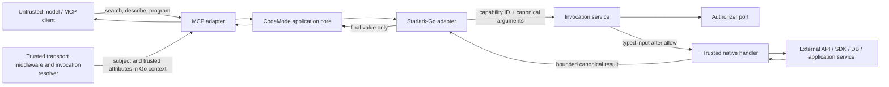

# CodeMode Architecture

## 1. Problem statement

CodeMode is a Go framework for building code-native Model Context Protocol (MCP) servers. A server author registers new, native Go capabilities backed directly by application services, established SDKs, databases, and protocols. The framework exposes only a small MCP surface—`search_api`, `describe_api`, and `execute`—so a model can discover a Starlark API progressively and compose several native calls in one program.

The architectural problem is to preserve that compact model-facing surface without weakening the native Go boundary. Discovery metadata, generated Starlark reference, input validation, authorization, runtime binding, handler dispatch, and result conversion must all describe the same capability. Credentials and trusted identity must stay in Go. Untrusted Starlark must receive only explicitly enabled functions and must not gain ambient filesystem, environment, network, subprocess, SDK-client, credential, or module-loading access.

The repository is currently an uncustomized Go application template: `go.mod` still declares `github.com/meigma/template-go`; `cmd/template-go`, `internal/cli`, `internal/config`, and `internal/templateinfo` implement a Cobra/Viper example; and the release configuration assumes a standalone binary and image. CodeMode is a framework, not a configurable generic proxy binary. Implementation therefore begins with a clean repository cutover to the `github.com/meigma/codemode` library and removes the template application rather than adapting its CLI into a generic server.

## 2. Decision summary

1. **Use an immutable capability registry.** Authors register typed capabilities through a builder, then call `Build`. Build compiles names, schemas, codecs, references, search indexes, deployment filtering, and erased runtime handlers into one immutable catalog. Registration is closed before serving.
2. **Keep one stable identity and one model-facing name per capability.** An opaque `CapabilityID` is the authorization and audit identity; a dotted `CapabilityName`, such as `github.list_repos`, is the Starlark contract. Both are unique. A display rename cannot silently change policy identity.
3. **Derive a restricted value contract from Go types.** A compiled type plan handles Starlark binding, canonical values, validation, typed Go decoding, output conversion, and reference/schema generation. The supported subset is deliberately narrower than arbitrary Go or JSON Schema.
4. **Separate application orchestration from adapters.** Pure catalog, schema, value, reference, and budget logic lives in focused packages. Starlark-Go, the official MCP Go SDK, optional embedded Rego, logging, transports, and native capability implementations are single-purpose adapters behind narrow ports.
5. **Authorize at the native call boundary.** Deployment filtering happens once at build time. Per-invocation authorization happens after canonical argument validation and immediately before every Go handler call. It never relies on source inspection.
6. **Use a fresh Starlark-Go thread for every execution.** Programs define `main()`; module initialization cannot invoke capabilities. Each thread receives only the immutable namespaces produced from the enabled catalog. `load` is unavailable, recursion remains disabled, and execution is bounded by steps, time, native-call count, concurrency, and value sizes.
7. **Keep the MCP surface fixed and small.** `search_api` returns compact ranked summaries, `describe_api` returns deterministic generated reference for exact names, and `execute` accepts one Starlark program and returns only its final representable value.
8. **Do not claim hard isolation.** Starlark-Go cancellation can wait while a Go builtin is blocked, and it provides neither a hard per-execution memory ceiling nor process isolation. An adversarial prototype creates an explicit evidence gate for retaining in-process execution or moving it into workers.
9. **Make authentication host-controlled and non-secret.** Trusted transport middleware or a process-local resolver supplies a subject and execution attributes from Go context. Credentials remain in that context or in services closed over by handlers; they are never converted to CodeMode values.
10. **Keep OPA optional.** The core accepts an application-defined `Authorizer`. The `rego` adapter prepares and reuses a local query, restricts unsafe Rego builtins, and fails closed. CodeMode does not require an OPA daemon or network policy service.

## 3. Goals

- Keep the initial MCP tool catalog small and make API discovery progressive.
- Let one Starlark program perform loops, branches, dataflow, and multiple native calls without additional model round trips.
- Make capability registration the single source of truth for discovery, reference, validation, runtime dispatch, result conversion, and authorization identity.
- Preserve trusted authenticated subject and credentials across the Go request context without representing credentials in Starlark.
- Ensure disabled capabilities are absent from discovery, description, and execution.
- Ensure every attempted side effect passes argument validation, resource accounting, and per-call authorization first.
- Provide an ergonomic, typed Go authoring API without exposing Starlark or MCP implementation types to capability handlers.
- Remain deterministic, testable without I/O, and maintainable under the repository’s strict hexagonal architecture rules.
- Provide honest, configurable resource controls and actionable failure classification.
- Deliver in working vertical slices whose measurements determine search, schema, containment, and concurrency refinements.

## 4. Non-goals

- Proxying another MCP server or translating downstream MCP schemas.
- Importing legacy MCP tools or exposing `call_tool(name, params)`.
- Providing raw HTTP, raw SDK clients, generic SQL, shell, filesystem, environment, or subprocess escape hatches to Starlark.
- Implementing an identity provider, OAuth server, secret store, or credential broker.
- Authorizing by parsing, rewriting, or pattern-matching Starlark source.
- Supporting arbitrary Python packages, Starlark `load`, user modules, or dynamic code loading.
- Supporting all Go types or all JSON Schema features in the initial codec.
- Automatically retrying arbitrary capability handlers. A generic retry can duplicate side effects; a focused capability adapter or its SDK owns protocol-aware retries and idempotency.
- Streaming intermediate capability results through MCP. Starlark materializes values in-process, and only the program’s final value crosses the MCP boundary.
- Providing a generic standalone CodeMode binary whose capabilities are selected at runtime. Native capabilities are compiled into the author’s server.
- Claiming hostile multi-tenant process isolation from an in-process Starlark interpreter.

## 5. Terminology

| Term | Meaning |
|---|---|
| **Capability** | One registered native operation with metadata, a stable identity, typed input/output codecs, and a Go handler. |
| **Capability ID** | Stable, opaque policy and audit identity. It does not need to be shown to the model. |
| **Capability name** | Dotted Starlark name, for example `github.list_repos`. It is part of the model-facing API contract. |
| **Catalog** | Immutable, deployment-filtered set of compiled capabilities. |
| **Canonical value** | Bounded, immutable CodeMode value: null, Boolean, string, signed integer, finite float, list, or string-keyed object. |
| **Subject** | Trusted, non-secret authenticated identity supplied from Go context. |
| **Execution** | One call to the MCP `execute` meta-tool, with a fresh Starlark thread and resource budget. |
| **Invocation** | One native capability call made during an execution. |
| **Native handler** | Trusted Go function that calls an application service, SDK, database port, or protocol adapter. |
| **Deployment filter** | Startup policy that removes capabilities from the catalog before serving. |
| **Authorizer** | Engine-agnostic port evaluated for every valid native invocation before its handler runs. |
| **Reference** | Deterministically generated Starlark signature, documentation, constraints, and output type for a capability. |

## 6. Invariants

1. A capability is either present in search, description, and runtime bindings, or absent from all three.
2. Every model-facing name resolves to exactly one stable capability ID. Duplicate IDs or names fail `Build`.
3. Every alias, if aliases are introduced in a later contract, must close over the same compiled capability and invoke the same authorization callback. The initial API has no aliases.
4. Positional and keyword calls normalize to the same canonical object before authorization.
5. Invalid, duplicate, missing, or unknown arguments cannot reach the authorizer or handler.
6. A valid invocation cannot reach its handler until the call budget and authorizer have both allowed it.
7. Policy evaluation errors, malformed policy decisions, cancellation, and panic all fail closed.
8. Handlers receive typed Go input and trusted invocation metadata, never raw Starlark values or a `*starlark.Thread`.
9. Credentials are not fields of `Subject`, `Invocation`, canonical values, policy input, logs, or MCP results.
10. Only a final canonical value leaves `execute`; intermediate values remain in the thread.
11. A server catalog is immutable after `Build`. Dynamic capability registration and hot policy/catalog reload are not supported initially.
12. Each execution has a fresh thread, fresh budget, fresh execution ID, and no globals shared with another execution.
13. Module initialization cannot invoke a native capability. Side effects are enabled only while `main()` or a helper called from `main()` is running.
14. The core performs no I/O. MCP, Starlark, Rego, logging, clocks, and native external operations enter through ports or adapters.
15. No framework error returned to the model includes credentials, raw request headers, raw source, arguments, capability results, SDK response bodies, or Go stack traces.

## 7. Trust boundaries



### 7.1 Untrusted inputs

The MCP envelope, meta-tool arguments, Starlark source, positional and keyword values, and all data returned by external systems are untrusted. Client-reported identity, MCP client metadata, `_meta`, and program-provided fields never select a subject or credential.

### 7.2 Trusted framework inputs

Deployment configuration, registered capability descriptors, compiled codecs, application-defined authorizer implementations, local Rego policy, and the invocation resolver are trusted configuration or code. They are validated at startup where possible.

### 7.3 Trusted native code

Capability handlers are trusted Go code. CodeMode prevents accidental ambient access from Starlark, but it cannot stop a malicious or defective registered handler from returning a secret or ignoring cancellation. Handler review, focused ports, output schemas, and tests remain part of the security boundary.

### 7.4 Credential path

HTTP middleware authenticates a request and places a principal and any request-scoped client/credential selector in `context.Context`. For stdio, the host supplies an explicit fixed or process-derived invocation resolver. CodeMode copies only the non-secret `Subject` and bounded trusted attributes into its invocation domain. The original derived context reaches the registered handler, allowing a closed-over service or client factory to select credentials. No credential value is converted to a canonical or Starlark value.

## 8. End-to-end flows

### 8.1 Startup and catalog build

1. The host constructs a `codemode.Builder` with limits, a deployment filter, an authorizer, and observability ports.
2. `codemode.Register` accepts each typed capability and immediately validates basic metadata.
3. `Build` validates stable IDs and dotted names, compiles input and output type plans, compiles schemas, validates examples, erases the typed handler behind a native invocation closure, and rejects unsupported types or tags.
4. The deployment filter evaluates every complete descriptor. A filter error fails startup; a false decision removes the capability.
5. The enabled definitions produce one immutable catalog snapshot, deterministic API references, a compact search index, and immutable namespace prototypes.
6. `Build` computes a catalog revision digest over sorted IDs, names, metadata, and schemas. The digest is for diagnostics and cache validation, not authorization.
7. The MCP adapter registers exactly the three meta-tools against the built `*codemode.Server`.

There is no partially usable server: any duplicate, invalid schema, failed policy preparation, unknown filter ID, or invalid limit prevents `Build` or adapter construction from succeeding.

### 8.2 Discovery

1. The MCP adapter validates the typed `search_api` or `describe_api` input using the official SDK’s tool boundary.
2. The invocation resolver derives a trusted subject from Go context. Authentication failure returns a tool error before catalog access.
3. `search_api` normalizes a bounded query and ranks only the immutable enabled catalog. It returns bounded summaries and signatures.
4. `describe_api` performs exact name lookup and renders the already-compiled reference; it does not reflect over Go types per request.
5. No per-argument authorizer runs during discovery because there are no capability arguments. Capability metadata is deployment-visible, not subject-filtered, in the initial contract.

Deployment-visible metadata is an explicit security property. A deployment that considers capability names sensitive must place those capabilities in separate filtered server instances until a distinct, engine-agnostic visibility policy is justified.

### 8.3 Execution

1. The MCP adapter rejects an oversized `program` before parsing and resolves the trusted subject from context.
2. The server acquires a bounded execution slot. If saturated, it returns a retryable `busy` error without creating a thread.
3. The server creates an execution ID, derives the overall deadline, initializes call/value/log budgets, and creates a fresh Starlark thread.
4. The Starlark adapter installs immutable namespaces for enabled capabilities. It supplies a bounded `Print` sink, sets `Load` to reject module loading, applies a step limit, retains recursion prohibition, and connects context cancellation to `Thread.Cancel`.
5. Module code is compiled and evaluated in a **loading** phase. Pure constants and helper definitions may initialize, but every capability builtin rejects calls in this phase.
6. The adapter requires exactly one callable `main` with zero parameters. It switches the execution state to **running**, invokes `main()`, and lets helpers called by `main` use the same state and budget.
7. Every builtin call follows the invocation flow below.
8. The value returned by `main()` is converted to a bounded canonical value. Unsupported values, non-string dictionary keys, non-finite floats, or integers outside the supported signed 64-bit range fail execution.
9. The MCP adapter serializes only that final value as structured tool output. Program prints and intermediate values are never included.

### 8.4 Native invocation

1. The builtin charges one attempted native call before argument work, so loops over denied or malformed calls cannot bypass the call budget.
2. The compiled binder accepts positional and keyword forms, rejects duplicates and unknown names, applies no implicit defaults, and converts values into typed Go input plus one canonical argument object.
3. Structural and declarative schema validation completes before authorization. Optional `None` and omission normalize identically.
4. The invocation service constructs the stable `authz.Input` from trusted subject/execution metadata, stable capability identity, and untrusted canonical arguments.
5. The authorizer runs under a deadline bounded by the execution deadline. Any error or non-allow decision fails closed.
6. The service derives a per-call context whose deadline cannot exceed the overall execution deadline, then calls the typed handler synchronously.
7. The handler output is converted and validated by the compiled output plan before becoming a Starlark value.
8. The builtin charges output node and byte budgets and returns the value to the running program.

The framework does not start a detached goroutine to abandon a blocked handler. Doing so would allow side effects and resource use to continue after the model receives a timeout. Handlers must honor their context; inability to force that behavior is an explicit limitation.

## 9. Domain model

### 9.1 Capability definition

A public generic `Capability[In, Out]` contains:

- stable `CapabilityID`;
- unique dotted `CapabilityName`;
- one-line `Summary` used in search results;
- full `Description` used in generated reference;
- bounded `Keywords` used only for search;
- input and output codec selections, derived from `In` and `Out` by default;
- a typed `Handler[In, Out]`.

A compiled capability adds an immutable input plan, output plan, schema documents, reference model, search document, namespace path, and erased handler. It is an internal build artifact, not a second source of author-supplied truth.

### 9.2 Identity types

`CapabilityID`, `CapabilityName`, `ExecutionID`, `SubjectID`, `Issuer`, and `TenantID` are domain types rather than interchangeable strings. IDs use an intentionally conservative printable grammar and bounded length. Capability names use ASCII Starlark identifiers joined by dots:

```text
[a-z][a-z0-9_]*(\.[a-z][a-z0-9_]*)+
```

The last segment is the function name; preceding segments form immutable namespace objects. Reserved Starlark words and framework bindings are rejected. Names are case-sensitive but lowercase-only, eliminating case-folding ambiguity.

### 9.3 Subject and execution context

`authz.Subject` contains a required subject ID and issuer plus optional tenant, sorted roles, and bounded canonical attributes. It contains no token, secret, credential reference, or raw header.

`authz.Execution` contains execution ID, transport name, start time, and bounded trusted attributes supplied by the host, such as a deployment or workspace identifier. It does not contain Starlark source.

### 9.4 Canonical values

The `value` package defines immutable tagged values and read-only object/list accessors. Objects retain deterministic sorted keys for policy input, reference examples, digests, and tests. Supported kinds are:

- null;
- Boolean;
- UTF-8 string;
- signed 64-bit integer;
- finite IEEE-754 float;
- list;
- string-keyed object.

Canonical values have explicit depth, node, string, and aggregate-byte accounting. They do not carry Go pointers, functions, channels, SDK objects, credentials, or Starlark values.

### 9.5 Result

A successful execution result contains exactly one canonical `Value`. Internal statistics go to the observer, not to the model-facing result. Search and description have separate bounded domain result types.

### 9.6 Error

A `codemode.Error` carries a stable code, safe public message, optional capability name, optional Starlark source location, retryability, and an internal wrapped cause. Only the safe projection crosses MCP. Sentinel errors exist only where callers need control flow, such as denied, not found, exhausted, deadline, invalid program, and busy.

## 10. Hexagonal package decomposition

```text
.
├── doc.go                         # package codemode overview
├── builder.go                     # public authoring facade and immutable Build boundary
├── capability.go                  # generic public capability and handler contracts
├── server.go                      # concrete application service
├── limits.go                      # validated resource configuration
├── errors.go                      # stable public error taxonomy
├── value/
│   ├── doc.go                     # canonical immutable value domain
│   └── ...
├── authz/
│   ├── doc.go                     # subject, policy input, decision, Authorizer port
│   └── mocks/                     # mockery-generated Authorizer mock
├── mcpserver/
│   ├── doc.go                     # MCP inbound adapter
│   ├── server.go                  # three typed meta-tool registrations
│   ├── context.go                 # trusted invocation resolver port
│   └── mocks/                     # generated service/resolver mocks
├── rego/
│   ├── doc.go                     # optional embedded OPA adapter
│   └── authorizer.go              # prepared local query implementation
├── internal/
│   ├── capability/                # descriptor compilation and erased handler
│   ├── schema/                    # type-plan and schema compilation
│   ├── catalog/                   # immutable lookup, search, and reference index
│   ├── reference/                 # pure deterministic Starlark reference renderer
│   ├── invoke/                    # authorize-then-dispatch application service
│   │   └── mocks/
│   ├── program/                   # execution orchestration, phases, and budgets
│   │   └── mocks/
│   └── starlark/                  # Starlark-Go outbound interpreter adapter
│       └── mocks/
├── internal/e2e/testserver/       # compiled native test server, never released
└── docs/docs/
    ├── tutorials/
    ├── how-to-guides/
    ├── reference/
    └── explanation/
```

### 10.1 Dependency direction

- `value` and `authz` are stable domain packages with no adapter dependencies.
- The root `codemode` package is the thin application facade. It owns builder/server construction and delegates to internal pure services.
- `internal/capability`, `internal/schema`, `internal/catalog`, and `internal/reference` are pure and deterministic.
- `internal/program` defines the interpreter runner port it consumes; `internal/starlark` implements that port.
- `internal/invoke` depends on the `authz.Authorizer` port and an erased native handler port, not on Rego or an SDK.
- `mcpserver` defines the narrow service and invocation-resolver interfaces it consumes. `*codemode.Server` satisfies the service interface; the adapter depends on the official MCP SDK.
- `rego` depends on `authz` and OPA. Nothing in the core depends on `rego`.
- Native capability handlers live in the consuming server repository. Each should close over a focused application port rather than a broad SDK surface.

This preserves accept-interfaces/return-concrete behavior: `codemode.New` returns a concrete builder, `Build` returns a concrete server, `mcpserver.New` returns a concrete MCP adapter, and adapters accept narrow consumer-owned interfaces.

### 10.2 Current repository integration points

| Current path | Architectural treatment when implementation begins |
|---|---|
| `go.mod` | Rename the module to `github.com/meigma/codemode`; replace Cobra/Viper application dependencies with core, MCP, Starlark, schema, test, and optional adapter dependencies. |
| `cmd/template-go` | Remove. The framework has no generic production binary. The executable test server belongs under `internal/e2e/testserver`. |
| `internal/cli`, `internal/config`, `internal/templateinfo` | Remove with their scaffold tests. Configuration remains programmatic in the core and transport/application-specific at composition roots. |
| `moon.yml` | Change metadata and make library build, unit/integration tests, lint, docs, race tests, and separately gated end-to-end tests explicit. |
| `.goreleaser.yaml`, `melange.yaml`, `apko.yaml`, release and image workflows | Remove binary/image publication unless a separately approved first-party server is added. Keep library tags/changelog only if the repository publishes versioned Go releases. |
| `README.md`, `docs/docs/index.md` | Replace template content with CodeMode documentation; all user documentation remains under `docs/` and follows Diátaxis. |
| `AGENTS.md` | Remains authoritative: every package receives `doc.go`; every function, type, and field receives Godoc; ports receive generated mocks; no Go source file approaches 1,000 lines. |

## 11. Public Go authoring API

The authoring surface is intentionally small. The exact declarations may evolve during the first slice, but the contract shape is fixed:

```go
builder := codemode.New(codemode.Options{
    Limits:     codemode.DefaultLimits(),
    Filter:     deploymentFilter,
    Authorizer: authorizer,
    Observer:   observer,
})

err := codemode.Register(builder, codemode.Capability[ListReposInput, []Repository]{
    ID:          "github.repositories.list",
    Name:        "github.list_repos",
    Summary:     "List repositories in an organization.",
    Description: "Returns repositories visible to the authenticated subject.",
    Keywords:    []string{"repository", "organization"},
    Handler: func(ctx context.Context, call codemode.Call, in ListReposInput) ([]Repository, error) {
        return repositories.List(ctx, call.Subject, in)
    },
})
if err != nil {
    return err
}

server, err := builder.Build(ctx)
if err != nil {
    return err
}

mcpAdapter, err := mcpserver.New(server, invocationResolver, mcpOptions)
```

This is an API sketch, not an implementation prescription. The important properties are:

- registration is a generic function because Go methods cannot introduce their own type parameters;
- the builder is mutable and single-threaded; the returned server is immutable and concurrency-safe;
- handlers receive standard `context.Context`, trusted non-secret call metadata, and typed input;
- handlers do not receive Starlark tuples, keyword pairs, MCP requests, raw JSON, credential values, or a generic tool name;
- absence of an authorizer is a build error. Deliberately unrestricted deployments must pass an explicit `authz.AllowAll()` implementation;
- authentication is not inferred. The MCP adapter requires an invocation resolver; a static stdio subject is explicit configuration rather than an implicit anonymous fallback;
- custom codecs are registered as a schema-and-value pair, so a codec cannot change conversion without also defining its model-facing schema.

## 12. Capability registration and compilation

### 12.1 Registration lifecycle

`Register` is valid only before `Build`. It rejects nil handlers, empty metadata, invalid IDs/names, oversized descriptions or keyword sets, and obvious duplicates. `Build` performs whole-catalog checks and codec/reference compilation. Calling `Register` after build returns a specific state error; it never mutates the live server.

The builder owns author-supplied slices only after copying them. The built server retains immutable compiled forms and does not reflect over handler types on the execution path.

### 12.2 Input shape

The default input type is a non-pointer Go struct. Exported fields form Starlark parameters:

- `json` tags define parameter names; names must also be valid non-reserved Starlark identifiers;
- declaration order defines positional order and generated signature order;
- non-pointer fields are required;
- pointer fields are optional; omitted and explicit `None` both canonicalize to absence and decode to nil;
- `omitempty` controls output encoding only and does not silently change input requiredness;
- framework defaults are not applied initially. Defaults would need to run before authorization and introduce another source of truth, so handlers use explicit optional values instead;
- unknown fields, duplicate positional/keyword assignment, excess positional values, and unsupported struct embedding fail registration or binding deterministically.

Reordering fields is therefore a breaking positional API change and must be treated as such in release notes. Keyword calls remain stable across a field reorder, but CodeMode does not hide the positional break.

### 12.3 Supported types

The initial derived codec supports Boolean, string, fixed-width signed integers, finite floats, slices, arrays, string-keyed maps, named aliases of supported scalars, nested structs, pointers for optionality, and explicitly supported standard types such as RFC 3339 timestamps. It rejects interfaces, arbitrary `any`, functions, channels, complex numbers, unsafe pointers, cyclic object graphs, maps with non-string keys, untagged unions, and opaque SDK types.

A custom `Codec[T]` may support an additional domain type only by supplying all of the following as one object:

- its canonical representation;
- its schema/reference representation;
- bounded decode and encode behavior;
- validation behavior.

Custom codecs cannot receive execution context, perform I/O, resolve credentials, or return Starlark builtins. They are pure conversion adapters, not capability escape hatches.

### 12.4 Schema and validation

A single schema compiler walks each Go type into an immutable `TypePlan`. The plan owns field mapping, requiredness, supported constraints, canonical conversion, and reference types. The same plan renders Draft 2020-12 JSON Schema for machine-readable description and compiles declarative constraints for runtime validation.

Conventional `json` and documented `jsonschema` tags provide names, descriptions, enumerations, lengths, numeric bounds, and patterns. Unsupported or contradictory tags fail `Build`; they are never silently ignored. Input validation occurs on the canonical object before authorization. Output validation occurs before a handler result becomes visible to Starlark.

The direct type plan decodes into `In` and encodes `Out` without a JSON marshal/unmarshal round trip on every call. This avoids unnecessary copies on the execution path while retaining a standards-based schema document.

### 12.5 Naming and namespace binding

A name such as `github.repos.list` creates nested immutable namespace values `github.repos` with builtin attribute `list`. Namespace/function collisions fail build—for example, registering both `github.repos` as a function and `github.repos.list` as a nested function is invalid.

Each builtin closes over only:

- stable capability ID and name;
- immutable input/output plans;
- the invocation port;
- per-execution state obtained from the thread local.

It does not close over raw credentials. It cannot dispatch by an untrusted name. Future aliases, if justified, must reference this same compiled object rather than creating a second authorization path.

### 12.6 Reference generation

Reference generation is pure and deterministic. A described capability includes:

- canonical dotted name;
- compact Starlark-like signature;
- summary and description;
- parameter names, types, requiredness, constraints, and descriptions;
- output type and description;
- validated examples when supplied by the author.

A representative signature is:

```text
github.list_repos(org: str, limit: int | None = None) -> list[Repository]
```

The notation is documentation, not runtime type annotation syntax. References and search documents are generated at build time, sorted deterministically, and bounded before storage. Examples are parsed during build so invalid Starlark never enters reference output.

## 13. MCP meta-tools

The MCP adapter exposes tools only. It does not expose prompts, resources, capability-specific MCP tools, or downstream MCP sessions.

### 13.1 `search_api`

Input:

- `query`: required trimmed string, 1–256 bytes;
- `limit`: optional integer, default 8, maximum 20;
- `namespace`: optional exact namespace filter.

Output contains a bounded ordered array of `{name, signature, summary}`. It does not return full schemas, handler identities, policy details, or capability IDs.

The initial search index is an in-memory deterministic token index. Ranking weights exact dotted-name and final-segment matches highest, then namespace and keyword matches, then summary/description token matches. Stable name order breaks score ties. This boring lexical design is inspectable and sufficient until real catalogs demonstrate a recall problem; embeddings and an external search service are rejected initially because they add I/O, nondeterminism, deployment weight, and another trust boundary.

### 13.2 `describe_api`

Input:

- `names`: one to eight exact capability names.

Output contains the generated reference for each found name in request order. Missing names are reported individually without substituting fuzzy matches. The response is capped by the description-output budget; callers can request fewer names if the aggregate reference is too large.

Exact lookup prevents a description request from unexpectedly expanding context. `search_api` is the only fuzzy discovery operation.

### 13.3 `execute`

Input:

- `program`: one Starlark source string, bounded by `MaxSourceBytes`.

There is no user-supplied timeout, call budget, capability allow-list, subject, credential, raw header, module path, or environment option. Deployment configuration owns all enforcement limits.

Success returns structured content equivalent to:

```json
{"result": <final canonical value>}
```

Failure returns an MCP tool result with `isError: true` and a structured safe error. JSON-RPC/protocol errors are reserved for malformed MCP envelopes and transport/server failures; valid `tools/call` requests whose program, policy, capability, or budget fails remain tool execution errors, consistent with the official Go SDK’s error model.

## 14. Authentication and authorization

### 14.1 Authentication boundary

`mcpserver.InvocationResolver` is a narrow adapter port:

```text
Resolve(context.Context) -> trusted Subject + trusted Execution attributes, or error
```

For Streamable HTTP, server authors put authentication middleware before the MCP handler and implement the resolver by reading typed values from the trusted request context. For stdio, authors supply a fixed local subject or a resolver bound to the process environment at composition time. The resolver does not inspect meta-tool arguments, source, MCP client self-identification, or `_meta`.

CodeMode does not put credentials into `Subject`. Credential selection remains in a context-bound client factory or a service closed over by a handler. This keeps the policy identity inspectable while preventing secrets from entering interpreter values.

### 14.2 Layer one: deployment capability filter

The deployment filter runs during `Build` over complete, validated capability metadata. Its result creates the catalog snapshot:

- disabled capabilities are absent from search results;
- `describe_api` treats them as unknown;
- no Starlark namespace contains their builtins;
- unknown IDs referenced by declarative filter configuration fail startup;
- filter errors fail startup rather than falling back to enabled.

This layer is deployment-scoped and stable for the server lifetime. A configuration change builds and swaps a new server instance through normal deployment, avoiding races and partial catalog states.

### 14.3 Layer two: per-invocation authorizer

The public engine-agnostic port is:

```text
Authorize(context.Context, authz.Input) error
```

A nil error allows. A typed denied error denies. Every other error—including cancellation, timeout, panic recovery, remote failure in an application-defined authorizer, or malformed decision—fails closed and is classified as a policy failure.

The call occurs after canonical decoding and schema validation, but before typed handler dispatch or any side effect. It runs for every call, not once per program. No decision is cached by the core because arguments, execution attributes, and policy data may vary.

### 14.4 Stable policy input

The versioned logical document is:

```json
{
  "version": "codemode.authz/v1",
  "subject": {
    "id": "user-123",
    "issuer": "https://issuer.example",
    "tenant": "tenant-7",
    "roles": ["developer"],
    "attributes": {}
  },
  "capability": {
    "id": "github.repositories.list",
    "name": "github.list_repos"
  },
  "execution": {
    "id": "01...",
    "transport": "streamable_http",
    "started_at": "2026-08-22T12:00:00Z",
    "attributes": {}
  },
  "arguments": {
    "org": "meigma",
    "limit": 25
  }
}
```

`subject`, `capability`, and `execution` are trusted. `arguments` is untrusted but canonical and schema-valid. Roles are sorted and duplicate-free. Attributes use canonical values and share strict size limits. The document excludes credentials, source, raw headers, SDK clients, intermediate results, and handler output.

`version` changes only for a breaking policy-input contract. Additive fields within `v1` require adapters and policies to tolerate unknown fields; semantic changes require `v2`.

### 14.5 Optional embedded Rego adapter

The `rego` package implements `authz.Authorizer` without changing the core. At construction it:

1. loads policy modules and static data from Go-provided bytes or readers at the composition boundary;
2. prepares a configured query once, defaulting to `data.codemode.authz.decision`;
3. rejects compile errors before the server starts;
4. restricts capabilities to an allow-list of pure builtins, excluding network and runtime introspection such as `http.send`;
5. enables strict builtin errors.

The prepared query is reused concurrently. Each evaluation receives the stable input above and the call context. The query must yield exactly one object of the form `{"allow": boolean, "reason": string?}`. Only `allow: true` permits the call. Undefined, empty, multiple, wrong-type, false, timeout, cancellation, or evaluation error denies. `reason` is bounded and available to trusted audit events; it is not returned verbatim to the model.

OPA remains optional: an application can supply a simple Go authorizer with no OPA dependency, and CodeMode never requires an OPA sidecar or remote policy service. If the OPA module’s size becomes material for library consumers, `rego` can become a separately versioned Go submodule without changing `authz.Authorizer`.

## 15. Starlark sandbox and resource controls

### 15.1 Available language surface

The initial interpreter is Starlark-Go. A thread receives standard pure Starlark operations plus enabled CodeMode namespaces. CodeMode explicitly provides no `load` implementation, filesystem, environment, socket, HTTP, subprocess, reflection, unsafe, Go SDK client, credential, or dynamic builtin constructor.

Registered outputs become only plain Starlark scalars, lists, tuples where appropriate, and string-keyed dictionaries. Namespace values are immutable. Mutable results are newly allocated per call and never shared between executions.

Programs may define pure helpers, loops, comprehensions, and branches. They must define callable `main()` with no arguments. Capability calls during module initialization fail before authorization or side effects. Recursion remains disabled; CodeMode does not mutate Starlark-Go’s process-global resolver options after startup.

### 15.2 Default limits

The initial defaults are conservative hypotheses and are all validated at build time:

| Limit | Initial default | Enforcement point |
|---|---:|---|
| Source size | 64 KiB | Before parse |
| Starlark execution steps | 1,000,000 | `Thread.SetMaxExecutionSteps` across load and `main` |
| Overall execution time | 30 s | Derived context plus `Thread.Cancel` |
| Per-capability call time | 10 s, capped by overall deadline | Before authorizer/handler |
| Native call attempts | 64 | At builtin entry |
| Concurrent executions | 32 | Server admission semaphore |
| Canonical nesting depth | 32 | Input, handler output, and final result conversion |
| Canonical nodes per value | 100,000 | Conversion traversal |
| Canonical bytes per native input/output | 1 MiB | Conversion and schema validation |
| Final result size | 1 MiB | Before MCP serialization |
| Program print bytes | 16 KiB | Thread print callback |
| Search results | 20 | Catalog query |
| Described capabilities per call | 8 | Exact lookup |

Raising a limit is explicit; zero does not mean unlimited. Per-call and policy deadlines are always clamped to the remaining overall execution time. Budget arithmetic uses checked counters to prevent overflow.

`print` is routed to a bounded execution observer and discarded by default. It is never returned in MCP success output. When an operator explicitly enables program-print logging, the documentation warns that a program can print intermediate API data; exceeding the print budget cancels the program.

### 15.3 Cancellation behavior

A context cancellation callback calls `Thread.Cancel`. Starlark-Go observes cancellation between interpreter steps. Native builtins receive derived contexts and are expected to return promptly. The cancellation callback is always stopped when execution ends so executions do not leak goroutines or timers.

Starlark-Go documents that cancellation can be delayed while a Go builtin is running. CodeMode cannot safely preempt a Go handler, and synchronous dispatch intentionally avoids pretending that a timed-out side effect stopped. First-party handlers must use context-aware SDK methods and bounded clients.

### 15.4 Memory and isolation limitations

Step, node, depth, byte, and concurrency limits reduce memory exposure, but they are not a hard heap ceiling. Starlark-Go has no supported per-thread allocator budget, and an in-process interpreter has no process boundary. A handler or interpreter allocation may occur before CodeMode can reject the resulting value. Go’s runtime also does not guarantee prompt return of RSS to the operating system.

The framework therefore promises **restricted capabilities and bounded accounting**, not hard memory or process isolation.

### 15.5 Containment decision gate

Before calling the runtime production-ready for mutually untrusted tenants, an adversarial prototype must run nested collections, large comprehensions, high-cardinality dictionaries, repeated executions, cancellation loops, large handler results, and deliberately blocked test builtins. It records peak live heap, retained heap after repeated runs, process RSS trend, step throughput, cancellation observation latency, and leaked goroutines.

In-process execution remains the default only if, at the proposed production limits:

- a single adversarial execution stays below a 64 MiB live-heap delta;
- retained heap and goroutine counts stabilize across 10,000 executions;
- interpreter-only cancellation is observed within 100 ms at p99;
- every first-party builtin returns within one second of context cancellation;
- the target deployment does not require a hard tenant memory boundary.

Failure of any condition, or a deployment requirement for hard hostile-tenant isolation, moves execution behind a supervised worker-process adapter before that deployment. The worker would preserve the same program-runner and invocation contracts, use a constrained IPC value protocol, enforce OS/container CPU and memory limits, and keep credentials in the worker’s trusted Go context. This is a measured decision point, not a claim that the first in-process version already provides those guarantees.

## 16. Errors and results

### 16.1 Stable error codes

| Code | Meaning | Retryable by caller |
|---|---|---:|
| `invalid_request` | Invalid meta-tool arguments | No |
| `unauthenticated` | Trusted invocation resolver could not establish a subject | Usually no |
| `not_found` | Requested API name is absent from the enabled catalog | No |
| `invalid_program` | Parse, resolution, `main`, top-level-call, or representability failure | No |
| `invalid_arguments` | Capability arguments failed binding or schema validation | No |
| `permission_denied` | Authorizer made a valid deny decision | No |
| `policy_failure` | Authorizer errored, timed out, panicked, or returned a malformed decision | Operator-dependent; not automatically retried |
| `resource_exhausted` | Step, call, size, depth, node, or print budget exceeded | No without changing the program |
| `busy` | Execution concurrency capacity is full | Yes |
| `deadline_exceeded` | Overall or per-call deadline elapsed | Only if the operation is known safe to retry |
| `capability_failed` | Native handler returned a safe domain failure | Defined by the handler |
| `result_not_representable` | Handler or `main` returned an unsupported value | No |
| `internal` | Invariant violation or recovered panic | Usually no |

### 16.2 Safe error projection

A handler may return a documented safe domain error containing a public code, public message, and retryability. Undeclared errors become an opaque `capability_failed` message. Wrapped causes, SDK payloads, policy reasons, source excerpts, and Go stacks go only to trusted observability with redaction.

Starlark locations may include synthetic filename, line, and column, but not the source line itself. Backtraces are bounded and include only Starlark function names and locations. Panic recovery exists at authorizer, handler, interpreter, and MCP adapter boundaries to preserve server availability; it cannot roll back a side effect that occurred before a panic.

### 16.3 Result conversion

Capability results are validated and converted before re-entering Starlark. The final `main()` value is independently converted before MCP serialization. Dictionary keys must be strings; integers must fit signed 64-bit; floats must be finite; functions, builtins, namespaces, sets, and cyclic values are rejected.

Objects serialize deterministically for tests and digests, though clients must not depend on JSON key order. `None` becomes JSON null. A missing optional field remains absent rather than becoming null unless its declared output contract explicitly permits null.

## 17. Configuration, lifecycle, concurrency, and observability

### 17.1 Configuration

The core accepts typed programmatic `Options`; it does not read files, environment variables, or flags. A consuming application may add a focused configuration adapter. This avoids Viper precedence in the domain and makes the same server construction testable without process state.

Configuration groups are:

- validated resource `Limits`;
- deployment capability filter;
- mandatory authorizer;
- observer and optional program-print sink;
- safe error mapper policy;
- MCP adapter limits and invocation resolver;
- Rego adapter modules, data, query, and pure builtin capabilities when used.

Secrets are never configuration values accepted by the core. Native services and transport middleware own secret retrieval.

### 17.2 Lifecycle

The builder has `registering`, `building`, and `built` states and is not concurrency-safe by design. `Build` is one-shot. The server is immutable and concurrency-safe.

The MCP transport owns listener/session lifecycle. Graceful shutdown follows this order:

1. stop accepting new MCP work;
2. reject new executions;
3. cancel the server root context, which cancels active threads and cooperative builtins;
4. wait for active executions up to the caller’s shutdown deadline;
5. return any remaining blocked-handler condition to the host so process supervision can decide whether to terminate.

The core has no background catalog refresh and no persistent state to flush. A Rego prepared query and immutable search index require no shutdown hook.

### 17.3 Concurrency

Starlark execution is sequential within one program. CodeMode exposes no goroutine primitive. Separate MCP `execute` calls run concurrently up to the admission limit. The catalog, schemas, reference strings, namespace prototypes, and prepared Rego query are immutable and shared. Per-execution state, builtins, mutable Starlark results, contexts, and budgets are not shared.

Registered handlers and application-defined authorizers must be safe for concurrent use. A non-concurrent external service belongs behind its own focused serialized adapter; CodeMode does not place a global lock around all capabilities. The race detector is part of CI.

### 17.4 Observability

The core accepts a narrow observer port and defaults to a no-op. A standard `log/slog` adapter is sufficient initially; OpenTelemetry is not a core dependency. Events include catalog build, search latency/result count, description size, execution admission/start/end, step count, native call count, authorization outcome, handler latency, error code, and budget exhaustion.

Events exclude source, arguments, results, credentials, raw subject attributes, policy documents, and SDK bodies by default. Subject IDs are omitted or transformed by an application-supplied audit adapter. Program `print` is a separate opt-in channel with its own byte budget.

## 18. Dependencies

| Dependency | Purpose and boundary | Decision |
|---|---|---|
| Go standard library | Contexts, HTTP composition, encoding, synchronization, structured logging | Preferred throughout. The repository currently targets Go 1.26.6. |
| `go.starlark.net` / Starlark-Go | Interpreter adapter | Initial language runtime. Mature, embeddable, supports step counts and cancellation, with the documented limitations above. Pin a reviewed commit/version in `go.mod`; do not track an unpinned branch. |
| `github.com/modelcontextprotocol/go-sdk` | MCP adapter | Use the official v1 API line. Its typed tool handlers and structured tool results keep protocol parsing out of the core. SDK churn is isolated in `mcpserver`. |
| `github.com/invopop/jsonschema` | Standards-based schema derivation/rendering support | Use only inside schema compilation after verifying its tag semantics against CodeMode’s restricted type plan. Unsupported semantics fail build. |
| `github.com/santhosh-tekuri/jsonschema/v6` | Compile and enforce generated Draft 2020-12 constraints | Mature validator isolated in `internal/schema`; schemas compile once at build, not per call. |
| `github.com/open-policy-agent/opa/v1/rego` | Optional embedded Rego authorizer | Imported only by `rego`; never required by core construction or as a remote service. Review binary/module weight after the authorization slice. |
| `github.com/vektra/mockery` and Testify | Generated port mocks and behavior assertions | Development/test dependencies. No handwritten mocks. |
| Testcontainers for Go | Deterministic live-service end-to-end tests | End-to-end test dependency, separately gated when Docker is required. |

Cobra and Viper are not core dependencies. A consuming server may choose them, but the CodeMode framework has no flags or environment precedence to manage. A lexical in-memory search implementation avoids Bleve, embeddings, and external search infrastructure until measurements justify them.

## 19. Testing strategy

Testing follows the repository’s required three layers and tests observable behavior rather than implementation plumbing.

### 19.1 Unit tests: pure domain behavior

- Capability ID/name grammar, collision detection, namespace collision, deterministic catalog digest.
- Type-plan compilation, tag validation, required/optional behavior, positional/keyword canonical equivalence, constraint enforcement, output validation, depth/node/byte accounting, and unsupported types.
- Canonical value immutability and deterministic object ordering.
- Search ranking, namespace filters, stable tie-breaking, result caps, and disabled-capability absence.
- Deterministic reference generation and build-time example validation.
- Error safe projection and source-location bounding.
- Budget transitions, checked arithmetic, execution phases, and state invariants.
- Policy input normalization, role ordering, and exclusion of secret-bearing fields.

### 19.2 Integration tests: core plus generated mock adapters

Every narrow port has a `mockery`-generated mock in a `mocks/` subpackage under its primary package. Handwritten mocks are prohibited.

- Program service with a generated runner mock verifies fresh execution state, admission, cancellation, and final conversion.
- Invocation service with generated authorizer and handler mocks proves validation-before-authorization, authorization-before-handler, fail-closed errors, no handler call after denial, and call-budget charging.
- Starlark adapter with a generated invoker mock executes real programs covering loops, helpers, branches, top-level-call rejection, missing/invalid `main`, disabled `load`, recursion rejection, step limits, cancellation, and final value conversion.
- MCP adapter with a generated service/resolver mock uses the official SDK’s in-memory or HTTP test transport to verify the exact three tool schemas, structured success, tool-error versus protocol-error behavior, authentication failure, and output caps.
- Rego adapter compiles and evaluates real local policies, including undefined, false, malformed, strict-builtin, cancellation, and concurrent evaluation cases.
- Adapter contract suites run against each real adapter and its port expectations.

### 19.3 End-to-end tests: actual surface and live services

A compiled test server registers several native capabilities backed by a deterministic containerized service. An official MCP client connects over Streamable HTTP and, where supported reliably, stdio. The scenario:

1. calls `search_api` and observes only enabled capabilities;
2. calls `describe_api` and uses the returned signature;
3. sends one Starlark program that branches, loops, and makes several native calls;
4. verifies the external service’s real state and the single final MCP result;
5. repeats with another subject and proves denial occurs with zero external side effects;
6. cancels an execution and observes cooperative handler shutdown.

Container-required tests use an explicit end-to-end build tag or Moon task rather than making ordinary unit tests nondeterministic. A small full-surface smoke test remains in CI. Live third-party API tests, if added, run separately with scoped credentials and are not required for contributor unit tests.

### 19.4 Security, fuzz, race, and performance evidence

- Fuzz Starlark-to-canonical decoding, schema tags, names, nested values, and error projection.
- Maintain adversarial programs for step, call, depth, node, source, output, and print limits.
- Include a credential canary in trusted Go context and prove it never appears in discovery, reference, policy arguments, default logs, Starlark globals, or MCP results.
- Run `go test -race` over concurrency-sensitive packages and integration suites.
- Benchmark catalog build, search, describe, builtin binding/decoding, policy input construction, and interpreter overhead separately from external API latency.
- Record initial MCP tool-schema bytes, average search/description response bytes, model round trips per composed task, peak live heap, cancellation latency, and native-call throughput. These measurements drive later stages rather than speculative optimization.

All packages receive `doc.go`. Every function, type, and struct field—exported or unexported—receives Godoc as required by `AGENTS.md`; public boundaries also receive examples. User-visible documentation is updated in the same change under `docs/` using Diátaxis.

## 20. Failure modes and handling

| Failure mode | Boundary behavior |
|---|---|
| Invalid registration, duplicate name/ID, unsupported schema, invalid example | `Register` or `Build` fails; no server is returned. |
| Deployment filter error or unknown configured ID | Build fails closed. |
| Authentication/resolver failure | Meta-tool returns `unauthenticated`; no catalog or execution work proceeds. |
| Search miss | Empty ranked results; this is not confused with an authentication empty state because authentication already succeeded. |
| Describe miss | Per-name `not_found`; no fuzzy substitution. |
| Parse/resolution error, missing `main`, wrong arity | `invalid_program` with bounded location. |
| Capability call during module initialization | `invalid_program`; authorizer and handler are not called. |
| Invalid capability arguments | `invalid_arguments`; authorizer and handler are not called. |
| Policy deny | `permission_denied`; reason is audit-only; handler is not called. |
| Policy error, timeout, malformed output, or panic | `policy_failure`; fail closed; handler is not called. |
| Handler transient failure | Safe handler classification is returned; framework does not retry automatically. |
| Step/call/value/print budget exceeded | Thread is cancelled and returns `resource_exhausted`. |
| Overall deadline | Thread cancellation plus context cancellation; blocked builtin limitation is reported to trusted observer. |
| Handler ignores context | Request may remain blocked until handler/transport/process ends; no false claim of successful cancellation. |
| Output conversion or validation failure | `result_not_representable`; value does not enter Starlark or MCP. |
| Execution saturation | Immediate retryable `busy`; no unbounded queue. |
| Panic | Boundary recovery, safe `internal`/`policy_failure` error, trusted stack logging; no rollback guarantee. |
| MCP disconnect | Execution context is cancelled; cooperative handlers stop. |
| Graceful-shutdown deadline expires | Shutdown reports remaining active work; process supervisor decides termination. |

## 21. Tradeoffs and rejected alternatives

| Alternative | Why rejected |
|---|---|
| One MCP tool per native capability | Reintroduces large initial context and repeated model round trips. |
| Downstream MCP client/proxy or schema importer | Contradicts the native capability model and creates a second authorization/schema boundary. |
| Generic `call_tool`, raw HTTP, generic SQL, or raw SDK access | Lets untrusted code choose operations dynamically and bypass stable policy identity. |
| Source parsing as authorization | Positional forms, aliases, helpers, dataflow, and runtime values make it incomplete and bypassable. Authorization belongs at the builtin callback. |
| Mutable runtime registry or hot reload | Creates discovery/binding races and partial policy states. Immutable rebuild/deploy is simpler and safer. |
| Mandatory remote OPA | Adds availability, latency, credential, and network dependencies to every side effect. |
| Mandatory embedded OPA | Makes a large policy dependency unavoidable for applications with simple Go policy. |
| Full arbitrary JSON Schema and `any` inputs | Produces ambiguous Starlark bindings, weak typed handlers, and difficult canonical policy input. A documented subset is safer. |
| JSON marshal/unmarshal between every Starlark and Go call | Simple but adds avoidable allocations and number ambiguities on a repeated execution path. Compiled type plans perform direct conversion. |
| Automatic generic retries | Can duplicate non-idempotent side effects. Focused capability adapters own retry semantics. |
| Vector/semantic search initially | Adds nondeterminism and infrastructure before catalog measurements show lexical search is insufficient. |
| Worker process for every execution immediately | Stronger containment, but adds IPC, startup latency, credential propagation, lifecycle, and deployment complexity before prototype evidence. It remains the defined escalation path. |
| A generic Cobra/Viper CodeMode binary | Cannot provide compiled native capabilities without becoming a dynamic plugin/proxy platform. Consumers own their composition root. |
| Returning prints, traces, or per-call results from `execute` | Violates the final-result-only context-efficiency promise and risks leaking intermediate data. |
| Detached goroutine timeout around handlers | Returns control while a side effect may still run, leaks resources, and gives a false cancellation guarantee. |

## 22. Resolved decisions

- The repository is a Go library first; the template CLI and binary/image release assumptions do not define the product.
- Starlark-Go is the initial interpreter.
- The official MCP Go SDK is the only MCP implementation dependency and is isolated at the boundary.
- `search_api`, `describe_api`, and `execute` are the complete initial MCP surface.
- Registration is typed, build-time, immutable, and the sole origin of catalog/reference/runtime behavior.
- Capability ID is distinct from model-facing name and is the policy identity.
- The initial value/schema contract is restricted and deterministic.
- Deployment filtering is build-time; per-call authorization is runtime and fail-closed.
- Authentication comes from trusted Go context and is never selected by tool arguments.
- OPA/Rego is an optional embedded adapter using a prepared local query and restricted builtins.
- Programs define zero-argument `main`; module initialization cannot perform native calls.
- No module loading, ambient I/O, dynamic dispatch capability, generic retries, or intermediate MCP results are provided.
- Execution is synchronous within a thread and bounded across requests by an admission semaphore.
- In-process Starlark is not described as hard memory or process isolation.

## 23. Unresolved decisions and open questions

These decisions require evidence or a product requirement; none blocks the first working vertical slice.

1. **Containment mode.** The adversarial prototype and deployment threat model determine whether in-process execution is sufficient or a worker-process adapter is required. The quantitative gate is defined in §15.5.
2. **Subject-specific discovery visibility.** The initial contract exposes deployment-enabled metadata to every authenticated subject while authorizing actual calls per argument. If capability existence is tenant-sensitive, introduce a separate visibility port; do not overload the per-call authorizer with fabricated arguments.
3. **Schema breadth.** Real capability sets will determine whether tagged unions, arbitrary-precision numbers, byte strings, richer time types, or opaque resource handles deserve explicit codecs. Unsupported types fail clearly until then.
4. **Search sophistication.** Lexical ranking remains until measured failed discovery queries show a repeatable recall gap. Any replacement must remain bounded, deterministic enough to test, and free of mandatory external I/O.
5. **OPA packaging weight.** Build size and dependency analysis will determine whether `rego` stays a package in the main module or becomes a separately versioned optional submodule. The `authz.Authorizer` contract is unchanged either way.
6. **MCP transport policy.** The first implementation supports official stdio and Streamable HTTP composition. Session persistence, resumability, CORS/origin defaults, and authentication middleware examples must follow the exact official SDK/spec version selected during implementation rather than being reimplemented in the core.
7. **Large results.** The initial 1 MiB final-result ceiling intentionally rejects large materialized data. If real workflows require larger artifacts, the product must choose an explicit, authorized resource-reference capability rather than silently raising memory limits or exposing generic storage.

## 24. Risks

| Risk | Consequence | Mitigation |
|---|---|---|
| A trusted handler leaks a credential in its output | Secret reaches Starlark or MCP | Focused handlers, output schemas, credential canary tests, safe logging defaults, and security review. The framework cannot defend against malicious trusted Go code. |
| A handler ignores context | Cancellation and shutdown can block | Require context-aware SDK methods, per-client timeouts, conformance tests, observability, and worker-process escalation where necessary. |
| Starlark allocation exceeds practical memory before a size check | Process memory pressure or crash | Steps, concurrency, node/depth/output caps, adversarial measurement, and explicit worker decision gate. |
| Schema/reference/decoder drift | Model writes calls that runtime interprets differently | One compiled type plan, build-time validation, golden reference tests, and positional/keyword equivalence tests. |
| Policy identity changes accidentally | Authorization gap or outage | Stable explicit ID distinct from name, duplicate checks, policy-input contract tests, and release review for ID changes. |
| Optional Rego enables unsafe builtins | Policy evaluation performs unexpected I/O | Prepare with restricted capabilities, exclude network/runtime introspection, use strict builtin errors, and test forbidden builtins. |
| Search returns poor matches | More discovery calls and model context | Instrument failed/empty searches and reference follow-through; change ranking only from measured workloads. |
| Official MCP SDK evolves | Adapter churn or protocol mismatch | Pin a reviewed v1 release and isolate all SDK types in `mcpserver`. |
| Large OPA/schema dependencies burden consumers | Build time and binary size | Keep adapters isolated, measure, and split optional module if warranted. |
| Metadata visibility is too broad for a deployment | Subject learns that a capability exists | Deployment partitioning now; separate visibility policy only when required. |
| Model retries a timed-out side effect | Duplicate external mutation | Safe retryability metadata, no automatic retries, focused adapters with idempotency keys where supported, and documentation. |

## 25. Agile staged delivery

Each stage ends with a runnable server and direct evidence from the actual MCP surface. A stage does not create unused extension frameworks for later stages.

### Stage 1: Minimal native vertical slice

- Perform the repository cutover from `template-go` to the library layout.
- Implement immutable registration for a narrow scalar/struct/list codec subset.
- Implement one deployment filter, explicit allow-all authorizer, catalog, lexical search, deterministic reference, fresh-thread Starlark execution, `main()`, step/time/call limits, and one native test capability.
- Expose the three meta-tools through the official MCP SDK over stdio or an in-memory transport.
- Prove end to end that a client searches, describes, and executes one program containing multiple native calls, receiving one final result.
- Record tool-schema bytes, search/description bytes, model round trips, execution overhead, and initial heap behavior.

The stage is useful as a local code-native server; it is not presented as hostile multi-tenant isolation.

### Stage 2: Canonical contracts and authorization

- Complete the restricted type plan, constraints, output validation, canonical immutable values, stable IDs, and safe errors.
- Add trusted invocation resolution, the versioned policy input, per-call application-defined authorizer, build-time deployment filtering, and audit-safe events.
- Add positional/keyword equivalence, denied-side-effect, disabled-capability, credential-canary, fuzz, and race coverage.
- Run a full MCP scenario with two subjects and a real containerized backing service.
- Measure authorization overhead, codec allocations, catalog build time, and context savings with a representative multi-capability catalog.

This stage is a complete secure application-defined-policy server without OPA.

### Stage 3: Runtime hardening and containment decision

- Add complete source/value/print/concurrency controls, module-loading rejection, module-phase side-effect guard, cancellation accounting, panic boundaries, and graceful shutdown.
- Run the adversarial corpus and 10,000-execution soak described in §15.5.
- Compare actual results to the containment gate and record the decision: retain the in-process adapter with documented limits, or implement the supervised worker adapter before multi-tenant production.
- Tune defaults only from measured behavior; do not raise limits merely to make adversarial tests pass.

This stage produces an honestly characterized execution envelope and a concrete containment choice.

### Stage 4: Production adapters

- Add the optional prepared-query Rego adapter with restricted pure builtins and fail-closed decision parsing.
- Complete `mcpserver` composition for Streamable HTTP and stdio using the pinned official SDK.
- Exercise authentication middleware, disconnect cancellation, saturation, graceful shutdown, concurrent Rego evaluation, and actual transport error semantics.
- Measure binary size with and without Rego, p95/p99 latency, cancellation lag, and maximum sustainable concurrent executions.

The core remains usable without Rego and without HTTP.

### Stage 5: Authoring and release quality

- Validate the API against several focused native capabilities backed by different kinds of ports: an HTTP SDK, a database service, and an application service.
- Refine schema features and search ranking only where those capabilities expose concrete gaps.
- Publish Diátaxis documentation under `docs/`: a first-server tutorial, capability/authentication/Rego how-to guides, generated API and limit reference, and explanations of trust boundaries and containment.
- Add public Godoc examples, compatibility policy for capability names/IDs/policy input, full Moon/CI tasks, and the appropriate library release workflow.
- Run the final end-to-end, race, fuzz, adversarial, docs, and release rehearsal paths before the first stable tag.

At every stage, the server remains a native Go capability host with the same three MCP tools. Later work deepens evidence and adapters; it does not change the product into a proxy, compatibility layer, or speculative plugin platform.