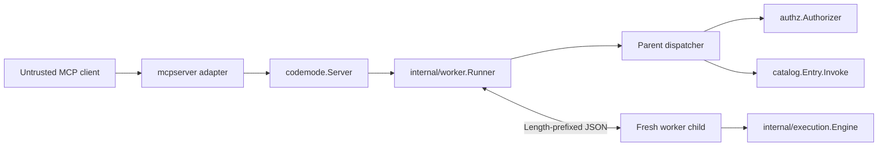

# Architecture: worker-only execution isolation

## 1. Decision and repository grounding

`Server.Execute` runs every Starlark program in a fresh worker process created by re-executing the host binary. There is no public in-process mode and no worker pool.

This closes the deadline-preemption gap in the current execution path. At commit `ccac0332a64c52530ebf0102849f73eecf867a12`, `internal/execution/execute.go` uses `watchCancellation` to call `starlark.Thread.Cancel`. Starlark observes that cancellation only after control returns from a monolithic Go built-in. The worker spike measured the following behavior on an Apple M4 Max running macOS:

- `list(range(8000000))` completed 25.7–30.8 ms after a 1 ms in-process budget;
- `list.extend(range(8000000))` completed 143.5–157.0 ms after a 1 ms in-process budget;
- a worker killed by its parent ended those same executions in 1.22–1.35 ms;
- a probe, including spawn, handshake, exit, and reap, had a 2.51 ms median;
- a trivial worker execution had a 2.33 ms median.

These measurements justify a fresh worker for each call against the existing five-second default. They are evidence from one machine, not portable latency guarantees or minimum supported budgets.

The design uses an interpreter-only child:



The child contains only:

- the Starlark interpreter;
- source, step, native-call, value-depth, and value-byte enforcement;
- generated namespace stubs for enabled capabilities;
- the private worker protocol adapter.

The parent retains:

- the trusted `authz.Subject`;
- the `authz.Authorizer`;
- registered handlers and their dependencies;
- the authoritative filtered `catalog.Catalog` and compiled `binding.Plan` values;
- credentials and the ordinary host environment.

A native call crosses the process boundary as an enabled capability ID and JSON-shaped arguments. The parent looks up the ID in the authoritative catalog, re-binds the decoded arguments with the registered `binding.Plan`, constructs a fresh canonical authorization map, authorizes, invokes the handler, converts the exact typed output, and returns only the converted value to the child. The child never receives a subject, authorizer, handler, service client, credential, or compiled `reflect.Type` plan.

`mcpserver.Service`, the MCP tool schemas, the successful `execute` envelope, and `mcpserver.projectToolError` remain unchanged.

## 2. Package layout and boundaries

```text
.
├── builder.go                  # validation, runner construction, startup probe
├── dispatch.go                 # unexported bind → authorize → invoke → convert
├── limits.go                   # public execution and discovery limits
├── server.go                   # Search, Describe, Execute, public error projection
├── worker.go                   # public worker-entry facades
├── internal/
│   ├── binding/                # plans and process-neutral value conversion
│   ├── catalog/                # authoritative validated and filtered catalog
│   ├── execution/              # child-side interpreter and native-call port
│   └── worker/
│       ├── doc.go              # private package contract
│       ├── frame.go            # frames, numeric codec, bounds, protocol state
│       ├── parent.go           # spawn, semaphore, exchange, kill, reap, probe
│       └── child.go            # serve one probe or execution request
├── authz/                      # parent-side authorization port and adapters
└── mcpserver/                  # unchanged inbound MCP adapter
```

This adds one internal package. It does not split wire DTOs, supervision, dispatch, and the child service into separate packages.

The boundaries follow the repository’s A1–A4 rules:

- `internal/execution` remains process-agnostic interpreter logic. It accepts a narrow native-call function and does not import `os/exec`, `authz`, or `catalog`.
- `internal/worker` is the same-executable transport adapter. Its files separate framing, parent supervision, and child service without introducing package-to-package DTO translations.
- `dispatch.go` contains unexported application sequencing. It calls the existing `authz.Authorizer` and `catalog.Invoker` ports and contains no pipe or process operations.
- `internal/binding` remains the only owner of the supported input/output type matrix and Starlark/JSON conversion rules.
- The root package exposes only the two worker functions needed by a final binary. Protocol types and process-launch configuration remain internal.

`Server` has one execution owner:

```go
type Server struct {
	catalog *catalog.Catalog
	runner  *worker.Runner
}
```

`worker.Runner` owns the immutable child manifest, the execution limits, the live-child semaphore, frame bounds, process supervision, and the captured parent dispatch callback. The callback receives the request-specific subject only in the parent path. Protocol structs have no subject field, and serialization code cannot accept one.

The existing catalog field remains because `Search` and `Describe` read it directly. The runner is the only field used by `Execute`; there is no partially initialized combination of engine, authorizer, limits, manifest, semaphore, and supervisor fields.

Every new package receives `doc.go`, every function and field receives godoc under D1–D4, and responsibility-oriented files remain below the 1,000-line cap.

## 3. Public Go API and host wiring

### 3.1 Required single-call worker entry

The normal integration path is one call:

```go
func main() {
	codemode.ServeWorkerAndExit()

	// Parse flags and construct credentials, clients, authorizers, handlers,
	// the CodeMode Server, and the host transport here.
}
```

A test binary that calls `Builder.Build` uses the same form:

```go
func TestMain(m *testing.M) {
	codemode.ServeWorkerAndExit()
	os.Exit(m.Run())
}
```

The exact additions are:

```go
// IsWorker reports whether the current process was re-executed as a CodeMode worker.
//
// Most hosts should call ServeWorkerAndExit instead. A host that uses IsWorker
// directly must still serve worker mode before flag parsing or constructing
// credentials, clients, authorizers, handlers, or a Server, and must not fall
// through into ordinary host wiring.
func IsWorker() bool

// ServeWorkerAndExit serves one CodeMode probe or execution request and
// terminates the process when the current process is a CodeMode worker. It
// returns immediately in an ordinary host process.
//
// Call ServeWorkerAndExit as the first statement of main, and of TestMain in
// every test binary that calls Builder.Build. The call must precede flag
// parsing and construction of credentials, service clients, authorizers,
// handlers, a Server, or a transport.
//
// In worker mode, ServeWorkerAndExit exits with status 0 after a successful
// exchange and status 1 after an internal worker or protocol failure. It does
// not return an error and writes no diagnostic. Standard output is reserved
// for protocol frames. In worker mode this function calls os.Exit, so deferred
// functions do not run.
func ServeWorkerAndExit()
```

`ServeWorker` is not exported. Removing its return value eliminates three easy mistakes: forgetting the worker guard, ignoring the error, and falling through into host startup after a successful exchange. `IsWorker` remains available for a final binary that genuinely needs to inspect the mode, but it is not the documented setup path.

The private environment marker is a mode switch and fork guard, not an authentication credential. Users must not set it themselves.

### 3.2 Godoc discovery path

The worker requirement must be discoverable without already knowing the worker function names.

The root `doc.go` gains a **Host wiring** section with the copy-paste `main` and `TestMain` forms above, the first-statement ordering rule, and the library-embedding rule below.

The high-traffic godoc changes are:

```go
// New creates a mutable one-shot Builder and copies caller-owned option slices.
//
// The final binary must call ServeWorkerAndExit as the first statement of main
// before it calls New or performs ordinary host setup. Test binaries that call
// Build must make the same call as the first statement of TestMain.
func New(options Options) *Builder

// Build closes the Builder and returns an immutable concurrency-safe Server
// after full validation and a same-executable worker probe.
//
// Build allows up to five seconds for the probe exchange, then kills and reaps
// the probe child; operating-system spawn and kill/reap overhead can extend the
// call beyond that exchange deadline. Build has no context and the probe
// deadline is not configurable.
//
// The final binary must call ServeWorkerAndExit as the first statement of main,
// and a test binary that calls Build must do the same in TestMain. The probe
// detects an absent or nonfunctional worker entry, but it cannot detect ordinary
// host work that completes silently before ServeWorkerAndExit is called.
func (builder *Builder) Build() (*Server, error)

// Server is an immutable, concurrency-safe capability catalog and Starlark
// execution service.
//
// Every Execute call runs Starlark in a fresh worker process and owns fresh
// budgets. An elapsed deadline kills and reaps that worker. Registered
// Authorizer and Handler implementations run in the parent, must honor their
// context, return promptly, and be safe for the caller’s concurrency.
type Server struct { /* unexported fields */ }

// Execute runs one bounded program for a trusted authenticated subject and
// returns only main’s final value.
//
// Execute re-executes the current binary for each call. The elapsed budget
// includes worker-slot waiting, process startup, protocol exchange, Starlark
// execution, and parent dispatch. Deadline or request cancellation kills and
// reaps the child, but CodeMode cannot forcibly stop parent-side Authorizer or
// Handler code that ignores its context.
func (server *Server) Execute(
	ctx context.Context,
	subject authz.Subject,
	program Program,
) (any, error)
```

A library that embeds CodeMode cannot satisfy the worker contract on behalf of an application it does not own. Its package documentation must tell downstream users to call `codemode.ServeWorkerAndExit()` in the final binary’s `main`, and in any downstream `TestMain` whose test binary calls `Build`. A wrapper may re-export an equivalently named helper, but the final binary must still call it first. Omitting the call causes that binary’s `Build` probe to fail in the detectable cases described below.

### 3.3 `Options`

`Options` gains no field:

```go
type Options struct {
	// Authorizer decides whether each validated native capability call may dispatch.
	Authorizer authz.Authorizer

	// DisabledCapabilities lists stable capability IDs removed from every live server surface.
	DisabledCapabilities []CapabilityID

	// Limits contains positive execution, conversion, and discovery budgets.
	Limits Limits
}
```

There is no public stderr sink, launcher, process interface, worker binary path, or execution-mode option. Execution-worker stderr is connected to `io.Discard`. The build probe alone uses a bounded internal stderr capture for startup diagnostics.

### 3.4 `Limits`

`MaxResultBytes` is removed in a clean cutover and replaced by `MaxValueBytes`:

```go
type Limits struct {
	// MaxSourceBytes is the maximum accepted Starlark source size in bytes.
	MaxSourceBytes int

	// MaxExecutionSteps is the maximum number of Starlark bytecode steps.
	MaxExecutionSteps uint64

	// MaxExecutionTime is the maximum elapsed execution budget. The budget starts
	// before waiting for a worker slot and covers spawn, protocol exchange,
	// Starlark execution, and parent dispatch. Killing and reaping can add
	// operating-system overhead.
	//
	// Process startup consumes part of this budget. The worker spike observed
	// 2.25–2.93 ms for a trivial end-to-end execution on one Apple M4 Max; that
	// measurement is not a portable lower bound. Measure deployment behavior
	// before configuring a low-millisecond value.
	MaxExecutionTime time.Duration

	// MaxNativeCalls is the maximum number of attempted native capability calls.
	MaxNativeCalls uint64

	// MaxValueDepth is the maximum nesting depth of any JSON-shaped value crossing
	// the worker boundary, including arguments, native results, and the final value.
	MaxValueDepth int

	// MaxValueBytes is the maximum encoded size of any JSON-shaped value crossing
	// the worker boundary, including arguments, native results, and the final value.
	// Size is measured by CodeMode’s type-preserving JSON value encoder.
	MaxValueBytes int

	// MaxSearchQueryBytes is the maximum capability-search query size in bytes.
	MaxSearchQueryBytes int

	// MaxSearchResults is the maximum number of capability-search results.
	MaxSearchResults int

	// MaxConcurrentExecutions is the maximum number of concurrent spawn attempts
	// and live execution-worker children. Waiting for a slot consumes
	// MaxExecutionTime and remains cancelable through the request context.
	MaxConcurrentExecutions int
}
```

`DefaultLimits` returns these deterministic values:

| Field | Default |
| --- | ---: |
| `MaxSourceBytes` | 65,536 bytes |
| `MaxExecutionSteps` | 1,000,000 |
| `MaxExecutionTime` | 5 seconds |
| `MaxNativeCalls` | 100 |
| `MaxValueDepth` | 32 |
| `MaxValueBytes` | 1,048,576 bytes |
| `MaxSearchQueryBytes` | 256 bytes |
| `MaxSearchResults` | 20 |
| `MaxConcurrentExecutions` | 8 |

`MaxConcurrentExecutions` is a constant, not a `GOMAXPROCS` sample. Parent `GOMAXPROCS` is not a useful proxy for the capacity of separate worker processes, and Go’s container-aware default can otherwise reduce a sub-core deployment to one serialized execution. Eight is a predictable, modest starting cap; deployments must tune it against memory, latency, and request concurrency.

`Limits.Validate` rejects every zero or negative limit; zero never means unlimited. It does not impose a fixed minimum on `MaxExecutionTime`. Startup and scheduler costs vary by platform and load, and the spike does not support a universal 50 ms floor. `Builder.Build` performs catalog-dependent checked frame-size calculations because the manifest and longest enabled capability ID are not known to `Limits.Validate`. Values that cannot fit the unsigned 32-bit frame calculations fail the build with `ErrInvalidRegistration`.

The broader value limit is intentional. A native argument or handler result larger than `MaxValueBytes` cannot cross the worker boundary even if the program would later reduce it to a small final result.

### 3.5 Existing signatures and changed contracts

These signatures remain unchanged:

```go
func Register[Input, Output any](builder *Builder, capability Capability[Input, Output]) error
func (server *Server) Search(query string) ([]SearchResult, error)
func (server *Server) Describe(name CapabilityName) (Description, error)
```

`New`, `Build`, and `Execute` also keep their signatures shown above, but their godoc and behavior change.

The changed contracts are:

- `Build` derives a child manifest from the validated, filtered catalog, constructs the runner, and performs one bounded same-executable probe before returning.
- `Execute` always creates one fresh child. There is no execution-mode option.
- `MaxExecutionTime` includes semaphore waiting. Cancellation while queued creates no child.
- A deadline or cancellation kills and reaps the child before `Execute` returns. The contract promises the configured deadline plus operating-system kill/reap overhead, not a universal numeric overrun bound.
- Authorizers and handlers receive the derived execution context in the parent. A call already running in trusted Go code can outlive `Execute` if it ignores cancellation.
- `Capability`, `Handler`, `authz.Authorizer`, `authz.AuthorizationInput`, and all MCP public signatures remain unchanged.

### 3.6 Honest probe detection and actionable errors

The build probe verifies only observable worker behavior. It detects:

- no worker branch when the re-executed binary instead exits, blocks beyond the probe deadline, or writes ordinary output to protocol stdout;
- a worker branch that produces malformed, oversized, out-of-state, or version-incompatible protocol data;
- pre-entry initialization or host setup that writes stdout, exits nonzero, or blocks beyond the probe deadline;
- executable resolution, spawn, pipe, exchange, exit, and reap failures.

The probe does **not** prove that `ServeWorkerAndExit` was the first statement of `main`. Host setup that completes silently before the call is not observable: the worker can still answer `probe_ack`, so `Build` succeeds. Package `init` functions also run before `main` and cannot be skipped. These are documented hazards with runtime fork guards, not claims of build-time detection.

A marker guard in `Build` returns exactly:

```text
invalid registration: Build ran in CodeMode worker mode; call codemode.ServeWorkerAndExit() as the first statement of main and of TestMain in test binaries, before flag parsing or constructing credentials, clients, authorizers, handlers, or a Server
```

All handshake wiring failures use this exact template and wrap `ErrInvalidRegistration`:

```text
invalid registration: CodeMode worker probe failed: <cause>; call codemode.ServeWorkerAndExit() as the first statement of main and of TestMain in test binaries, before flag parsing or constructing credentials, clients, authorizers, handlers, or a Server[; worker stderr: <quoted excerpt>]
```

The stable cause texts are:

| Observable failure | `<cause>` text |
| --- | --- |
| No acknowledgement and zero exit | `stdout closed before probe_ack` |
| Bytes cannot form the one legal acknowledgement | `stdout contained non-protocol data before probe_ack` |
| A JSON frame is present but invalid for the acknowledgement schema | `received malformed probe_ack` |
| Wrong internal protocol version | `protocol version mismatch: child reported <got>, parent requires 1` |
| Output follows a valid acknowledgement | `received data after probe_ack` |
| Nonzero exit with an exit code | `child exited with status <code>` |
| Other unsuccessful process state | `child exited unsuccessfully: <process state>` |
| Exchange deadline | `deadline exceeded after 5s` |
| Pipe or exchange I/O failure | `probe I/O failed: <underlying error>` |

If stdout closes before acknowledgement and the child also exits nonzero, the exit status takes precedence over incidental EOF. A fired probe deadline takes precedence over kill-induced pipe and exit errors.

Executable failures use separate accurate messages rather than suggesting that entrypoint wiring fixes an OS error:

```text
invalid registration: CodeMode worker probe could not resolve the current executable: <underlying error>
invalid registration: CodeMode worker probe could not start the current executable: <underlying error>
```

Probe stderr uses a writer that always consumes input but retains only the first 4,096 bytes. On probe failure, the parent converts invalid UTF-8 to replacement characters, trims surrounding whitespace, quotes the excerpt so the error stays one line, and appends it to the template. A truncated excerpt is labeled `worker stderr (truncated to 4096 bytes): <quoted excerpt>` instead. Empty stderr adds no suffix. A successful probe discards the capture.

Probe stderr is a trusted startup diagnostic and can contain messages from package initialization or pre-entry host code. Documentation must tell hosts not to return a `Build` error to an untrusted client. Per-execution worker stderr remains discarded and is never attached to an `Execute` or MCP error.

## 4. Worker protocol

### 4.1 Framing and decoding

Each frame consists of:

1. a four-byte unsigned big-endian payload length, excluding the prefix;
2. exactly one UTF-8 JSON object of that length.

A zero-length frame, truncated frame, invalid UTF-8, malformed JSON, trailing JSON document, unknown field, unknown frame type, invalid numeric token, or frame outside the current protocol state is a protocol violation.

The decoder:

- checks `utf8.Valid` before JSON decoding;
- selects the concrete frame type from the `type` discriminator;
- uses `encoding/json.Decoder.DisallowUnknownFields` for that concrete frame;
- uses `UseNumber` for JSON-shaped values;
- requires EOF after the one object.

The codec does not add a duplicate-key scanner. Standard decoder semantics select the materialized value; state validation and authoritative parent re-binding enforce the trusted contract afterward.

Every untrusted child-originated length is checked before allocation. An advertised length above the computed cap causes immediate protocol failure, kill, reap, and `ErrInternal`.

### 4.2 Version posture

The private protocol version is `1` and appears only on the initial handshake:

- `probe` and `probe_ack` carry `version`;
- `exec` carries `version`;
- later execution frames do not repeat it.

There is no negotiation, downgrade, or compatibility mode. Parent and child normally come from the path returned by `os.Executable` and are deployed atomically. A protocol change updates both endpoints and increments the internal constant. A mismatch fails a build probe with `ErrInvalidRegistration` and an execution with `ErrInternal`.

### 4.3 Frame set and state machine

| Direction | Type | Required payload | State rule |
| --- | --- | --- | --- |
| parent → child | `probe` | `version` | First and only request in a probe child. |
| child → parent | `probe_ack` | `version` | The child then exits zero. |
| parent → child | `exec` | `version`, `source`, child limits, capability manifest | First request in an execution child. |
| child → parent | `native_call` | `capability_id`, `arguments` | Legal while `main` runs and no response is outstanding. |
| parent → child | `native_result` | `result` | Response to the immediately preceding native call. |
| parent → child | `native_abort` | no payload | Terminal response for a parent-owned failure. |
| child → parent | `final` | `result` | Successful terminal result; the child then exits zero. |
| child → parent | `final_error` | `code` | Child-owned terminal failure; the child then exits zero. |

Only one native call can be outstanding. The child blocks for its response, so the next `native_result` or `native_abort` is unambiguous. There is no call ID or multiplexing state.

The successful sequence is:

```text
exec
(native_call → native_result)*
(final | final_error)
EOF and zero exit
```

A parent-owned failure changes the tail to:

```text
native_call → native_abort
EOF and zero exit
```

After `native_abort`, the child converts the response to a private interpreter-unwind sentinel, suppresses a `final_error`, and exits successfully. The parent retains and returns its own classification. If the child emits another frame, hangs, or exits incorrectly, cleanup still preserves the parent-owned error.

Child final codes are limited to:

```text
invalid_program
invalid_arguments
resource_limit
internal
```

`permission_denied`, `policy_failure`, and `capability_failure` never cross the wire. They originate in the parent and use `native_abort`. Error frames carry no message, source, argument, result, handler text, policy detail, panic value, or stack trace.

### 4.4 Capability manifest

The `exec` frame contains one entry per enabled capability:

```text
id
name
input: []binding.FieldShape
```

The input slice is the exact result of the existing `binding.Plan.InputShape()` method in `internal/binding/signature.go`. The design does not create a second field-kind descriptor. The child accepts only combinations the current compiler can produce: required `str` and optional `int | None`. Any other shape is a protocol error.

The manifest excludes summaries, descriptions, output descriptions, `reflect.Type` values, subjects, authorizers, invokers, handlers, contexts, environment values, and credentials. `Builder.Build` derives it once from `catalog.Catalog.Entries()` after disabled-capability filtering. The same authoritative catalog therefore drives search, description, namespaces, authorization identity, and dispatch.

The child receives:

- `MaxSourceBytes`;
- `MaxExecutionSteps`;
- `MaxNativeCalls`;
- `MaxValueDepth`;
- `MaxValueBytes`.

It does not receive `MaxExecutionTime` or `MaxConcurrentExecutions`; those are parent supervision concerns.

### 4.5 Type-preserving JSON numbers

The wire supports this value domain:

- `null`;
- booleans;
- strings;
- signed `int64` values;
- finite `float64` values;
- arrays of supported values;
- objects with string keys and supported values.

The encoder writes:

- an `int64` as base-10 digits without a decimal point or exponent;
- a finite `float64` using `strconv`’s shortest round-trippable spelling, adding `.0` when the spelling otherwise contains no `.`, `e`, or `E`.

The decoder retains numeric tokens as `json.Number`. A token containing `.`, `e`, or `E` must parse as a finite `float64`; every other token must parse as `int64`. Overflow, non-finite values, and unsupported Go numeric types are rejected. Therefore:

- `9223372036854775807` remains `int64`;
- `1.0` remains `float64`;
- `-0.0` remains a negative-zero `float64`.

Decoded `json.Number` values are normalized before binding or return and never escape the protocol package. This fixes the `int64`-to-`float64` erasure observed in the spike without adding a typed envelope around every scalar.

### 4.6 Value and frame bounds

`MaxValueBytes` measures the exact JSON bytes emitted for a value by the type-preserving encoder. The same encoder and value validator are used for native arguments, native results, and the final value. There is no separate public wire-size limit or canonical-JSON proof layer.

At build time, `internal/worker/frame.go` computes one maximum child payload from the largest of:

- a `native_call` envelope plus the longest encoded enabled capability ID plus `MaxValueBytes`;
- a `final` envelope plus `MaxValueBytes`;
- the fixed `final_error` envelope.

The calculation uses checked integer addition and must fit the unsigned 32-bit frame prefix. The parent checks this cap before allocating any child payload, then independently validates the decoded value’s depth, allowed types, and exact encoded size. A frame above the cap is a protocol violation, not a legal resource-limit report.

The fixed probe reader cap is the largest valid protocol-1 `probe_ack`; a probe cannot advertise an arbitrary allocation.

After decoding `exec`, the child computes the analogous parent-response cap from the fixed `native_result` envelope plus `MaxValueBytes`; `native_abort` is smaller. Writers encode once, check actual payload length, and then write the prefix and payload.

The initial `exec` frame is trusted parent input. `Builder.Build` validates that the encoded manifest plus the worst-case JSON string expansion of `MaxSourceBytes` fits the 32-bit prefix. `Execute` still checks the actual encoded frame before writing. The child reads the initial unsigned length, validates the complete `exec`, and then applies the configured response cap to subsequent parent frames.

A child that legally discovers that its final value exceeds `MaxValueBytes` sends `final_error(resource_limit)`. A child that advertises an oversized frame has violated the protocol and is classified as `ErrInternal`.

## 5. Execution lifecycle and data flow

### 5.1 Build-time probe

`Builder.Build` performs these steps:

1. Close the one-shot builder and run the existing authorizer, limit, registration, static-filter, namespace, and catalog validation.
2. Derive the immutable child manifest from enabled entries and `Plan.InputShape()`.
3. Validate initial-frame and child-frame arithmetic.
4. Construct the unexported parent dispatcher and capture its method in the runner.
5. If the private worker marker is present, return the exact marker-guard `ErrInvalidRegistration` error without spawning.
6. Resolve `os.Executable()` and start it with `argv[0]` equal to the returned executable path and an empty `argv[1:]`.
7. Give the child exactly the private marker in `cmd.Env`; do not append `os.Environ()`.
8. Connect child stdin and stdout to anonymous protocol pipes. Attach child stderr to the bounded 4 KiB probe capture. Pass no extra file descriptors.
9. Send `probe`, require the matching `probe_ack`, require protocol EOF and a zero exit, and call `Wait` exactly once.
10. Apply the fixed five-second probe exchange deadline. On timeout or failure, close pipes, kill if necessary, join protocol work, reap, and return the applicable exact error from §3.6.

The worker inherits the parent’s operating-system identity, current working directory, and deployment resource controls, but not the parent command-line arguments or environment. The final binary’s package initialization still runs before `ServeWorkerAndExit`.

The probe proves that the re-executed binary can enter and complete worker mode. It does not prove that no silent work ran first.

### 5.2 Process environment and command line

Probe and execution children have the same launch contract:

- `argv[0]` is the path returned by `os.Executable()`;
- `argv[1:]` is empty;
- the environment contains only the private worker marker;
- stdin and stdout are protocol pipes;
- probe stderr is bounded and diagnostic only on build failure;
- execution stderr is discarded;
- there are no application-supplied inherited file descriptors.

A worker must not depend on the parent command line. `ServeWorkerAndExit` must therefore run before `flag.Parse`, Cobra/Viper execution, or any other command routing.

The marker-only environment deliberately drops credentials and all ambient settings, including `GOMEMLIMIT`, `GOMAXPROCS`, `GODEBUG`, `TZ`, `SSL_CERT_FILE`, `HOME`, and application variables. Worker children use Go runtime defaults plus inherited OS/container controls. The design does not forward a runtime-variable allowlist: ambient runtime configuration would expand the child contract and is not a hard resource boundary. Linux cgroups or container limits remain the mechanism for memory and CPU containment.

### 5.3 Execute and semaphore acquisition

`Server.Execute` keeps the current root checks:

1. A nil server, nil context, or missing runner is `ErrInternal`.
2. An empty `subject.ID` is `ErrUnauthenticated`.
3. Source larger than `MaxSourceBytes` is `ErrResourceLimit` before spawn.

The runner then:

1. derives `runCtx` from the request context and `MaxExecutionTime`;
2. waits for the live-child semaphore with `runCtx`;
3. returns without spawning if cancellation or deadline occurs while queued;
4. rechecks the private worker marker and `runCtx` after acquiring a permit;
5. encodes the execution frame and starts `os.Executable()` under the launch contract above;
6. holds the permit from the spawn attempt until the process has been reaped or spawn fails.

The elapsed budget begins before semaphore waiting and remains active through spawn, protocol exchange, child execution, parent authorization and handler dispatch, and ordinary reap. Parent serialization is bounded by source and value limits. Trusted parent-side Go code remains context-cooperative rather than forcibly preemptible.

### 5.4 Child startup and interpreter execution

The child:

1. validates the `exec` envelope, version, limits, manifest shapes, capability IDs and names, namespace structure, and source length;
2. builds a fresh process-neutral `internal/execution.Engine` from the manifest;
3. constructs frozen namespace stubs for enabled capabilities only;
4. creates a fresh restricted `starlark.Thread`;
5. keeps `Load` disabled and `Print` discarded;
6. applies `SetMaxExecutionSteps` and the existing loading/running/done phase rules;
7. requires an exact zero-argument `main` function;
8. executes `main` and converts only its final value.

There is no request context, elapsed timer, authorizer, or handler in the child. Parent process kill is the elapsed-time preemption mechanism. The child keeps the Starlark step counter because it is deterministic interpreter accounting.

### 5.5 Native forwarding and parent dispatch

For one Starlark native call:

1. The namespace stub verifies `phaseRunning` and charges `MaxNativeCalls` before binding, preserving attempted-call semantics.
2. `internal/binding` binds Starlark arguments against the exact manifest `[]binding.FieldShape`. Positional, missing, unknown, wrong-kind, and overflowing arguments fail child-side. Duplicate keyword syntax remains a parser/runtime `ErrInvalidProgram` under the existing public contract.
3. The child validates the canonical argument map against `MaxValueDepth` and `MaxValueBytes`, sends `native_call`, and blocks for one response.
4. The parent verifies protocol state and calls `catalog.Catalog.LookupID`. An unknown or disabled ID is a protocol violation because it was absent from the manifest.
5. The authoritative `binding.Plan` re-binds the decoded map to the exact registered Go input type and creates a new canonical map. A discrepancy is a protocol violation and maps to `ErrInternal`; it is not projected as a caller argument error because the child should have rejected it.
6. The dispatcher calls `Authorizer.Authorize` with the request subject, enabled ID and name, and the newly constructed canonical map.
7. After an allow decision, the dispatcher rechecks `runCtx` before invoking `catalog.Entry.Invoke`.
8. The dispatcher recovers policy and handler panics using the existing classifications.
9. The authoritative plan converts the exact typed output directly to JSON-shaped Go data. The parent validates allowed types, depth, finite floats, and `MaxValueBytes` before the value crosses the pipe.
10. On success, the parent sends `native_result`; the child validates the value, converts it to Starlark, and resumes `main`.
11. On denial, policy failure, capability failure, output-conversion failure, or output value-limit failure, the parent retains the classified error, sends `native_abort`, reaps the child, and returns the retained error.

Each authorizer or handler call runs in a goroutine with a one-element completion channel. The exchange can therefore select on `runCtx.Done()` while trusted Go code runs. The buffered channel lets a late callback return without blocking after `Execute` has left.

### 5.6 Final result

On successful `main` completion, the child:

1. converts the Starlark value to the supported JSON-shaped domain under `MaxValueDepth` and a byte-derived materialization bound;
2. encodes it with the type-preserving value encoder;
3. sends `final`, or sends `final_error(resource_limit)` if a legal value exceeds `MaxValueBytes`;
4. exits normally.

The parent independently decodes and validates the final value’s numeric types, allowed types, depth, and exact encoded size. It requires EOF and zero exit before returning the value from `Server.Execute`.

### 5.7 Deadline, request cancellation, and deterministic cleanup

Each execution has one exchange goroutine. That goroutine owns stdin/stdout frame reads and writes and the sequential protocol state. The runner supervises it and selects between exchange completion and `runCtx.Done()`.

When the exchange receives a native call, it starts at most one dispatch goroutine and selects between its buffered result and `runCtx.Done()`. The child is blocked waiting for the response, so no concurrent frame reader or call identifier is required.

Cancellation, deadline, protocol violation, unexpected EOF, and I/O failure converge on one cleanup path:

1. close child stdin to unblock a write;
2. call `Process.Kill` if the child has not completed;
3. close child stdout to unblock `io.ReadFull`;
4. join the exchange goroutine;
5. call `Wait` exactly once;
6. release the semaphore permit.

Ordinary success and parent abort require protocol EOF before `Wait`. If cancellation is observable when a pipe or exit failure races with it, cancellation wins. A parent-owned error accepted before cleanup wins over abort-write and exit cleanup errors; an untrusted child cannot replace it.

The runner does not wait for a non-cooperative dispatch goroutine after cancellation. It kills and reaps the child and returns the context classification. The dispatcher’s post-authorization context check prevents a late allow from starting a handler, but a handler already invoked may continue in the parent. The semaphore bounds live children, not detached trusted Go work.

## 6. Changes to existing code

### 6.1 `internal/execution`

Retain:

- a fresh `starlark.Thread` per execution;
- `SetMaxExecutionSteps` and `OnMaxSteps`;
- disabled `Load`;
- discarded `Print`;
- exact `main` validation;
- the loading/running/done phase machine;
- the attempted native-call counter;
- Starlark runtime classification;
- final-value conversion through `internal/binding`.

Change the boundary:

- Build `Engine` from process-neutral capability bindings containing ID, dotted name, and the existing `[]binding.FieldShape`, not `catalog.Entry`.
- Make namespace stubs call a narrow native-call function supplied by the child adapter.
- Keep only phase, native-call count, step-limit state, and the native-call function in `executionState`.
- Remove `ctx`, `subject`, and `authorizer` from `executionState`.
- Make `callCapability` bind arguments and call the native-call port. It never authorizes or invokes a Go handler.
- Delete `authorize`, `invoke`, their parent panic-recovery paths, and `watchCancellation` from `internal/execution/execute.go`.
- Remove `MaxExecutionTime` from `internal/execution.Limits` and rename the value-size member to `MaxValueBytes`.

The interpreter remains unchanged in spirit. It moves behind a killable process boundary.

### 6.2 `internal/binding`

`binding.Plan` remains the single compiled source for input/output types, signatures, descriptions, and parent re-binding.

Add or refactor behavior in the existing package:

- Bind child Starlark arguments against the exact `[]FieldShape` returned by `Plan.InputShape()`; do not create another descriptor projection.
- Re-bind decoded JSON-shaped arguments to the exact registered input type and a fresh canonical authorization map in the parent.
- Convert an exact typed handler output directly to JSON-shaped Go data in the parent.
- Convert a validated JSON-shaped native result to Starlark in the child.
- Share supported-value and depth validation across final values, native arguments, and native results.
- Keep exact wire-byte measurement in `internal/worker/frame.go`, where the type-preserving encoder lives.

Delete the old direct typed-handler-output-to-Starlark path after all callers migrate. There is no compatibility wrapper.

The supported registration matrix remains unchanged: required string and optional `*int64` inputs; string, `int64`, bool, and finite `float64` outputs. Parent re-binding accepts only normalized wire values for that matrix and reconstructs its own canonical map rather than passing a decoded child map to `authz.AuthorizationInput`.

### 6.3 `server.go`, `builder.go`, `worker.go`, and `dispatch.go`

- Replace `Server.engine`, `Server.authorizer`, and `Server.limits` with one runner field alongside the catalog.
- Make `newServer` construct the parent dispatcher, derive the manifest, construct the runner, and run the probe.
- Keep `Server.Execute` root preconditions and `projectExecutionError` as the sole public projection point.
- Keep the builder’s current one-shot behavior and validation order, then add worker-size validation and the startup probe.
- Ensure `Builder.Build` wraps a probe failure exactly once with `ErrInvalidRegistration`; avoid nested `invalid registration` prefixes.
- Put only `IsWorker` and `ServeWorkerAndExit` facades in root `worker.go`.
- Put bind → authorize → context recheck → invoke → typed-output conversion and panic classification in root `dispatch.go`.

### 6.4 `internal/catalog`, `authz`, and `mcpserver`

- `catalog.Catalog.LookupID` remains the authoritative enabled-ID lookup.
- `catalog.Entry.Plan` and `catalog.Entry.Invoke` remain parent-only.
- `catalog.Catalog.Entries()` supplies the already-filtered manifest source.
- `authz.Authorizer` and `authz.AuthorizationInput` remain unchanged and parent-only.
- `authz/rego` preparation and evaluation remain in the host process.
- `mcpserver.Service.Execute`, the `execute` tool schema, the successful result envelope, and `mcpserver.projectToolError` remain unchanged.

## 7. Error classification

| Condition | Public result |
| --- | --- |
| Empty subject | `ErrUnauthenticated` before queue or spawn |
| Nil context, nil server state, or missing runner | `ErrInternal` |
| Source above `MaxSourceBytes` | `ErrResourceLimit` before spawn |
| Invalid syntax, duplicate keyword syntax, entry point, loading-phase call, runtime behavior, or unsupported final type | `ErrInvalidProgram` |
| Child rejects positional, missing, unknown, wrong-kind, or overflowing native arguments | `ErrInvalidArguments` |
| Authorizer returns an error wrapping `authz.ErrDenied` | parent retains `ErrPermissionDenied`; child receives `native_abort` |
| Authorizer returns another error or panics | parent retains `ErrPolicyFailure`; child receives `native_abort` |
| Handler returns an ordinary error | parent retains `ErrCapabilityFailure`; child receives `native_abort` |
| Handler output has an unsupported type or conversion fails | parent retains `ErrCapabilityFailure`; child receives `native_abort` |
| Handler panic | parent retains `ErrInternal`; child receives `native_abort` |
| Source, step, native-call, value-depth, or value-byte limit is legally reached | `ErrResourceLimit` |
| Parent handler output exceeds `MaxValueDepth` or `MaxValueBytes` | parent retains `ErrResourceLimit`; child receives `native_abort` |
| Semaphore waiting exhausts `MaxExecutionTime` | error wraps `ErrResourceLimit` and `context.DeadlineExceeded`; no child is spawned |
| Execution or request deadline | child is killed and reaped; error wraps `ErrResourceLimit` and `context.DeadlineExceeded` |
| Request cancellation | child is killed and reaped; `context.Canceled` |
| Unknown or disabled ID, parent re-bind mismatch, malformed/oversized/out-of-state frame, unknown final code, execution-time version mismatch, unexpected EOF/exit, or child numeric overflow | child is killed and reaped; `ErrInternal` |
| Spawn, pipe, kill, or wait failure without a stronger context or retained parent error | `ErrInternal` |
| External kill or OOM without parent-side resource evidence | `ErrInternal` |
| Build probe or catalog-dependent frame-size failure | `Build` returns an error wrapping `ErrInvalidRegistration` |

The distinction between a legal value limit and a protocol violation is deliberate. A child may report that a legal value exceeds `MaxValueBytes`; it may not advertise a frame longer than the cap.

`mcpserver.projectToolError` continues to strip wrapped detail and return the existing fixed client-visible text. Probe diagnostics exist only during trusted host startup and never pass through the MCP adapter.

## 8. Platform posture

### 8.1 macOS and Linux

Use `os.Process.Kill`, pipe closure, and `Wait`. The spike exercised this path on macOS. The child contract forbids subprocess creation, Starlark `load` remains disabled, and the worker has no process-launch capability, so killing the one worker is the correctness path.

Do not add Unix process-group management now. It becomes necessary if the worker contract later permits descendants; before then it is optional defense in depth with cross-platform and cleanup costs.

### 8.2 Memory and CPU containment

The change closes the elapsed-time preemption gap by moving Starlark to a killable process. It does not create a portable hard heap limit.

Linux deployments that require a hard memory or CPU ceiling must use cgroup v2 or a container/runtime limit. A service-level cgroup naturally contains the parent and re-executed workers. A true per-execution cgroup requires deployment-specific delegation and process placement, which this library does not own.

Worker children do not inherit `GOMEMLIMIT`, `GOMAXPROCS`, or `GODEBUG` from the host environment. They use runtime defaults. This is an explicit consequence of the marker-only environment, not a portable containment feature. Operators must use inherited cgroup or container limits when a hard boundary matters.

macOS remains development-grade for hard memory containment. If the OS kills a worker for memory pressure and the parent lacks cgroup or equivalent evidence, CodeMode returns `ErrInternal` rather than guessing `ErrResourceLimit` from an exit status.

### 8.3 Windows

The design avoids Unix-only syscalls and uses `os.Executable`, anonymous pipes, `os.Process.Kill`, and `Wait`. It must compile on Windows, but production support is not claimed until Windows CI verifies marker-only environment startup, no-argument re-exec, pipe closure, kill latency, exactly-once reap, and cancellation races. A Windows failure must not select an in-process fallback or weaken the deadline contract.

## 9. Test strategy

Tests exercise the production worker path. There is no test-only in-process mode, public launcher hook, process fake framework, or general malformed-worker mode.

### 9.1 Unit tests

`internal/worker/frame.go` tests use byte buffers and `io.Pipe` for:

- zero, truncated, and over-cap lengths;
- invalid UTF-8, malformed JSON, trailing documents, unknown fields, unknown types, and invalid state transitions;
- probe and execution state machines without call IDs;
- `math.MinInt64`, `math.MaxInt64`, integral floats, fractional floats, exponents, negative zero, overflow, and non-finite rejection;
- value depth and exact type-preserving encoded-byte measurement;
- checked cap arithmetic and 32-bit overflow.

Probe error formatter tests assert every exact message template, status precedence, 4 KiB stderr truncation, UTF-8 replacement, quoting, and absence of a suffix for empty stderr. These are pure unit tests; they do not require a malformed-child launcher seam.

`internal/binding` tests cover:

- agreement between child binding from `Plan.InputShape()` and authoritative parent re-binding for the full supported input matrix;
- missing, unknown, wrong wire kinds, and integer overflow;
- fresh canonical authorization maps;
- exact typed output to JSON conversion;
- JSON-shaped value to Starlark conversion and finite-float enforcement.

`internal/execution` tests retain behavior for exact `main`, loading/running/done phases, fresh state, source/step/native/depth/value limits, final conversion, and a function-backed fake native-call port. Cancellation-watcher tests are deleted because the parent now owns elapsed cancellation.

Root-package dispatch tests cover:

- bind → authorize → context recheck → invoke → convert order;
- denial, policy error, handler error, and panic classification;
- no authorization after re-bind failure;
- no handler start after a late authorization result and canceled context;
- value-limit failure becoming parent-retained `ErrResourceLimit`.

### 9.2 Same-binary integration tests

Every test binary that calls `Builder.Build` calls the production worker entry before `m.Run`. In the current repository, the root external-test package and `mcpserver` test package each add:

```go
func TestMain(m *testing.M) {
	codemode.ServeWorkerAndExit()
	os.Exit(m.Run())
}
```

The actual same-executable path covers:

- successful build probe;
- one focused `testdata` fixture binary without worker wiring, proving that `Build` fails with the actionable message and bounded stderr excerpt;
- trivial execution and exact final-value return;
- native forwarding with the handler PID equal to the parent PID;
- `math.MaxInt64`, `float64(1)`, and negative-zero type preservation;
- issue #12’s `list(range(8000000))` and `list.extend(range(8000000))` cases returning the existing deadline classification within a generous, non-flaky kill/reap bound;
- request cancellation while the child runs;
- cancellation and deadline while waiting for `MaxConcurrentExecutions`;
- permit release and subsequent execution after kill/reap;
- parent denial or handler failure aborting and reaping the child;
- one successful MCP `execute` and representative fixed MCP error projection;
- no-argument child startup independent of the parent test flags.

Parser corruption stays at the frame/state layer. Add another real malformed-child fixture only if implementation reveals an OS-lifecycle defect that buffers and `io.Pipe` cannot reproduce.

Run the integration path under `go test -race`. Race coverage includes parallel executions at the concurrency limit, cancellation during parent dispatch, and repeated kill/reap cycles. Assert process completion, permit release, and exchange-goroutine completion through runner-observable outcomes; do not infer cleanup from global goroutine counts.

## 10. Documentation impact

Update only pages whose instructions or contracts change.

### 10.1 Required source godoc

- `doc.go`: add the **Host wiring** section, copy-paste `main` and `TestMain`, first-statement ordering, and transitive library-embedding requirement.
- `builder.go`: update `New` and `Build` godoc with mandatory final-binary wiring, detectable and undetectable cases, and the fixed five-second probe exchange deadline.
- `server.go`: rewrite `Server` and `Execute` godoc around fresh child execution, kill/reap deadlines, semaphore waiting, and parent-side cooperative Go code.
- `limits.go`: document `MaxValueBytes`, broaden `MaxValueDepth`, document the constant concurrency default, and add the measured but non-portable process-startup warning to `MaxExecutionTime`.
- `worker.go`: give `IsWorker` and `ServeWorkerAndExit` the complete comments in §3.1.

### 10.2 User documentation and examples

- `docs/docs/tutorials/first-server.md`: make `codemode.ServeWorkerAndExit()` the first statement of `main`; place it before context, builder, and transport setup; explain that the SDK in-memory MCP transport remains in the host while every Starlark execution uses a child; replace the statement that CodeMode execution is entirely in-process; retain the requirement that handlers honor context.
- `docs/docs/reference/public-api.md`: add the worker-entry section; document `IsWorker`, `ServeWorkerAndExit`, `main`, `TestMain`, transitive library wiring, honest probe detection, exact startup messages, the fixed five-second probe deadline, argv and marker-only environment, probe-versus-execution stderr, worker-only `Execute`, `MaxValueBytes`, constant `MaxConcurrentExecutions = 8`, queue timing, numeric preservation, and kill/reap behavior. Correct `MaxValueDepth` to cover every crossing value. Correct the `ErrResourceLimit` row to include native arguments, native results, semaphore waiting, and all configured value limits. Remove `MaxResultBytes` and claims that execution limits are entirely in-process.
- `docs/docs/explanation/security-model.md`: redraw the trust boundary; put Starlark in the child and the subject, Rego, handlers, credentials, and authoritative catalog in the parent; explain parent re-binding, no-argument re-exec, marker-only environment and dropped runtime variables, fresh-child state, parent abort, kill/reap cancellation, undetectable late wiring and `init` behavior, and remaining trusted-Go and memory limitations. Rename “Rego policy runs in process” to “Rego policy runs in the host process.”
- `docs/docs/how-to/use-rego-authorization.md`: put `ServeWorkerAndExit` before `rego.New`, flag parsing, and all policy setup; explain only as needed that Rego preparation and evaluation stay in the host and are never constructed by the worker entry.
- `example_test.go` and `mcpserver/example_test.go`: rely on the package-level compile-checked `TestMain` worker entry. Capability registration and MCP calls otherwise remain unchanged.

### 10.3 Small corrective changes

- `docs/docs/index.md`: replace the inaccurate all-in-process overview with a short parent/worker summary and link to the security model. Keep limit defaults in the reference rather than duplicating them on the index.
- `docs/docs/reference/mcp-tools.md`: rewrite the complete value-limit sentence, not one identifier. State that `MaxValueDepth` and `MaxValueBytes` apply to arguments and native results crossing the worker boundary as well as the final value, while the successful MCP payload still contains only `result`. Keep worker protocol and concurrency internals out of the MCP schema reference.

### 10.4 No change

- `docs/docs/how-to/disable-capabilities.md`: disabled capabilities remain absent from the same catalog-backed discovery and execution surfaces; its instructions and visible contract do not change.

## 11. Explicit non-goals

- A public in-process, unsafe, or test-only execution mode.
- Worker pooling, reuse, or shared interpreter state.
- Sending subjects, authorizers, handlers, service clients, host environment, or credentials to the child.
- Serializing Go registration types, closures, `reflect.Type`, or compiled plans.
- A second manifest field-shape projection beside `binding.Plan.InputShape()`.
- A public protocol, external worker executable, remote execution, version negotiation, or downgrade.
- Call multiplexing, call IDs, retries, output streaming, or intermediate-result exposure.
- A graceful request-cancellation frame. `native_abort` is only the synchronous terminal response to a completed parent-side failure.
- A public worker-stderr sink, logger, launcher, clock, process interface, or fault-injection mode.
- Forwarding an ambient environment or a runtime-variable allowlist to the child.
- Unix process-group management while workers cannot create descendants.
- A portable `MaxMemoryBytes`, per-execution cgroup management, or guessed OOM classification.
- A universal minimum `MaxExecutionTime` derived from one machine’s measurements.
- A configurable probe deadline before deployment evidence requires one.
- Changes to MCP tools, schemas, successful payloads, or coarse error texts.

## 12. Risks

1. **Late worker entry is not observable when it succeeds silently.** If a host loads files, embedded credentials, global state, or service dependencies before `ServeWorkerAndExit` and that work completes without protocol stdout, exit, or timeout, the build probe succeeds and every execution repeats the work in the child. The first-statement API, package godoc, examples, and runtime fork guards reduce misuse; they cannot prove ordering.
2. **Go initialization runs before the worker entry.** Same-executable re-exec necessarily runs package `init` functions. Marker-only environment prevents ordinary environment credentials from entering the child, but embedded/global credentials, filesystem reads, and initialization side effects remain outside CodeMode’s control. Stdout, nonzero exit, and timeout are detectable; silent side effects are not.
3. **Non-cooperative trusted Go code can outlive execution.** An authorizer or handler that ignores context may continue after the child is killed and `Execute` returns. Repeated cancellation can accumulate parent goroutines because the live-child semaphore does not bound detached trusted work.
4. **There is no hard portable heap ceiling.** A worker can cause memory pressure before the OS or deployment boundary terminates it. Marker-only environment also means host `GOMEMLIMIT` is not inherited. Use cgroups or container limits for a hard deployment boundary.
5. **Operating-system timing remains external.** The parent timer hard-kills the child, but process scheduling and kill/reap latency are outside the Go API’s strict timing control. The macOS spike supports the design but is not a cross-platform bound.
6. **Probe stderr can contain trusted startup detail.** The bounded excerpt improves first-run diagnosis but can include host configuration messages. Build errors belong in trusted startup logs and must not be returned to MCP clients.
7. **The clean public limit rename is source-breaking.** `MaxResultBytes` becomes `MaxValueBytes`. The repository is pre-1.0 with no consumers, so a clean name is preferable to an alias with false semantics.
8. **A fixed concurrency default cannot fit every deployment.** Eight avoids cgroup-derived accidental serialization, but memory-heavy workers or high-throughput hosts may require lower or higher values.

## 13. Open questions

No open question forces a redesign before implementation.

1. **Windows production support:** Does Windows CI demonstrate correct marker-only startup, no-argument re-exec, pipe closure, kill/reap behavior, and race handling?
2. **Operational diagnostics:** Does deployment evidence require structured parent-side worker diagnostics beyond trusted build-probe stderr? If so, add them through an established logging port, not a raw concurrent writer.
3. **Deployment memory integration:** Do users need cgroup recipes or a separate host adapter after worker execution ships? The core API must not anticipate that need with a false portable memory limit.
4. **Concurrency tuning:** Do production workloads justify changing the constant `MaxConcurrentExecutions` default from 8?
5. **Probe deadline control:** Do startup SLOs show that the fixed five-second probe exchange deadline needs a `Limits` field? Keep `Build` context-free unless that evidence appears.

## 14. Rejected alternatives

- **Whole execution in the child:** rejected because it moves handlers, credentials, and Rego into the killable sandbox and couples worker memory to handler work.
- **Dual public execution modes:** rejected because an in-process escape hatch weakens the only deadline contract and becomes a less-tested path.
- **Two-function worker ceremony:** rejected for the documented path because `IsWorker` plus an error-returning `ServeWorker` permits fall-through, ignored-error, and unguarded-call bugs. `ServeWorkerAndExit` encodes the required terminal behavior in one call.
- **A public worker builder or duplicate registration path:** rejected because the parent can send a process-neutral manifest derived from the authoritative filtered catalog.
- **Separate wire, supervisor, child, and dispatch packages:** rejected until import cycles, file size, reuse, or independent change pressure justifies those boundaries.
- **Raw default JSON decoding:** rejected because the spike demonstrated loss of the `int64` contract.
- **Typed envelopes around every value:** rejected because deliberate number spelling plus `UseNumber` preserves the required distinction with less wire and conversion machinery.
- **Worker pooling:** rejected because measured spawn cost is approximately 2.5 ms against the five-second default and fresh processes simplify state and cleanup.
- **Graceful cancellation before kill:** rejected because it restores cooperative preemption to the deadline path. Parent `native_abort` is not cancellation; it only releases a child blocked on a completed failed dispatch.
- **Process fakes and a public/internal launcher seam:** rejected because framing is testable with buffers and OS lifecycle is better verified with actual same-binary children.
- **Process groups now:** rejected because the worker cannot create descendants.
- **Forwarding `GOMEMLIMIT`, `GOMAXPROCS`, or `GODEBUG`:** rejected for the initial design because it expands ambient child configuration without creating a hard resource boundary. Inherited cgroups and container limits are explicit and enforceable.
- **A 50 ms validation floor:** rejected because the measured trivial path was 2.25–2.93 ms on the spike machine and platform/load variability makes a universal rejection threshold unsound. The API documents the cost and keeps positive low values available for measured deployments.
- **A public probe-timeout setting now:** rejected to keep the surface minimal. The fixed five-second exchange deadline is documented; a new limit remains an evidence-gated addition.

## Appendix A. Review disposition

No complexity finding conflicts with the worker-only, same-executable, interpreter-only child, build-probe, hard-kill, fresh-child, numeric-preservation, deterministic-cleanup, or concurrency requirements.

1. **Public worker stderr option:** applied. There is no `Options.WorkerStderr`, typed-nil handling, mutex, capture test matrix, or public diagnostic surface. Execution-worker stderr is discarded. The build probe’s fixed 4 KiB internal capture is a narrow startup diagnostic added without restoring the removed option.
2. **Too many internal packages:** applied. The design adds only `internal/worker`; parent dispatch stays unexported in the root package, and interpreter/binding changes remain in their existing packages.
3. **Redundant protocol identity and proofs:** applied. The protocol has no `call_id`, carries version only on the initial handshake, uses the standard strict decoder plus explicit UTF-8 validation, and does not scan duplicate keys.
4. **Parent-owned error echoes:** applied. Parent failures use classification-free `native_abort`; the parent reaps the child and returns its retained classification.
5. **Process-fake framework and malformed-child matrix:** applied. Framing uses buffers and `io.Pipe`; lifecycle tests use real children; one focused miswired fixture covers startup wiring and bounded stderr without a launcher seam or general fault mode.
6. **Misnamed final-only byte limit:** applied with a clean cutover. `MaxResultBytes` becomes `MaxValueBytes` and covers every JSON-shaped value crossing the worker boundary.
7. **Fragmented `Server` state:** applied. `Server` stores the catalog and one concrete runner; the runner owns manifest, semaphore, framing, supervision, and the captured dispatch callback.
8. **Duplicate child descriptor projection:** applied. The manifest serializes the existing `Plan.InputShape()` result directly and adds no second field-shape type.
9. **Environment read cap and canonical-size proof stack:** applied. The marker is mode-only; one checked child-frame cap and actual type-preserving encoded value size replace an environment cap, arbitrary allowance, and expansion multiplier.
10. **Repeated documentation internals:** applied. Full changes are limited to host wiring, public API, security model, and Rego wiring. The index receives a link-oriented correction; `mcp-tools.md` changes only where value-limit semantics would otherwise be false; the disable-capabilities guide does not change.

## Appendix B. DevEx review disposition

1. **Correct the claim that a late worker branch fails `Build`: applied.** The proposal lists only observable probe failures and states in the API contract and risk section that silent pre-entry work and `init` side effects are not detectable.
2. **Specify probe failure messages and capture probe stderr: applied.** The proposal defines exact error templates and cause texts, precedence, a fixed 4 KiB quoted stderr excerpt, truncation behavior, and the trusted-only diagnostic boundary. Execution stderr remains discarded.
3. **Collapse the required entry to `ServeWorkerAndExit`: applied.** The documented path is one no-error call that returns only in a normal host and exits in worker mode. `IsWorker` remains for exceptional inspection, so the exported worker surface still has two functions.
4. **Put wiring on the godoc discovery path: applied.** Root `doc.go`, `New`, `Build`, `Server`, and `Execute` receive exact host-wiring and process-execution contracts. The package documentation contains copy-paste `main` and `TestMain` forms.
5. **Use a constant concurrency default: applied.** `MaxConcurrentExecutions` defaults to the documented constant 8 rather than environment-dependent `GOMAXPROCS`.
6. **Correct `MaxValueDepth` and `ErrResourceLimit` documentation: applied.** The documentation plan explicitly broadens both reference pages and replaces the tutorial’s false in-process boundary statement.
7. **Explain that a returned worker error cannot be reported: applied through the API redesign.** `ServeWorkerAndExit` has no return value, writes no diagnostic, and selects exit status internally. Its godoc reserves stdout and explains `os.Exit` behavior.
8. **Specify child argv: applied.** Both probe and execution children receive `argv[0]` from `os.Executable()` and no additional arguments. The requirement to run before flag or command parsing appears in godoc and reference documentation.
9. **Document the practical `MaxExecutionTime` floor: partially applied.** The godoc and reference will state the measured 2.25–2.93 ms trivial path, include spawn and queueing in the budget, and warn that low-millisecond settings are deployment-sensitive. The suggested “below roughly 50 ms will fail most executions” claim and a fixed validation floor are rejected because the spike contradicts that threshold and no portable minimum exists.
10. **Document dropped Go runtime environment variables: applied.** The launch contract and platform guidance name `GOMEMLIMIT`, `GOMAXPROCS`, and `GODEBUG`, as well as other ambient variables, and state that workers use runtime defaults. The runtime allowlist alternative is rejected because it expands ambient configuration without providing hard containment.
11. **Document library-embedding requirements: applied.** Package godoc and the public reference state that the final binary owns the call and that an embedding library must propagate the requirement to downstream `main` and `TestMain` entrypoints.
12. **Expose or document the five-second probe budget: applied by documentation.** `Build` stays context-free; its godoc and the builder-lifecycle reference state the fixed five-second exchange deadline, lack of cancellation/configuration, and possible operating-system overhead. A configurable limit remains evidence-gated.