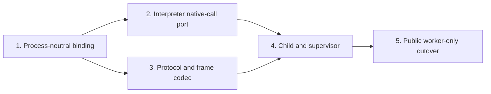

# Implementation plan: worker-only execution

## Grounding and sequencing

At `ccac0332a64c52530ebf0102849f73eecf867a12`, `Server` stores `catalog`, `engine`, `authorizer`, and `execution.Limits`; `internal/execution.Execute` owns the elapsed timer and `watchCancellation`; `binding.Plan.Bind` converts Starlark directly to the registered Go input; and `binding.Plan.ConvertOutput` converts a typed handler output directly to Starlark. The plan below replaces those paths without adding a compatibility mode, worker pool, launcher seam, external worker binary, stderr option, environment allowlist, or process-group logic.

Each increment is one GitHub squash-merge PR. The listed title is the Conventional Commit title that should become the squash commit subject.



- **Merge dependencies:** Increment 1 must merge first. Increments 2 and 3 can then proceed in parallel and merge in either order because increment 2 changes the root and `internal/execution`, while increment 3 creates `internal/worker` framing on top of the binding value contract. Increment 4 requires both. Increment 5 requires all prior increments.
- **Within increment 5:** the two `TestMain` additions, root integration-test expansion, MCP verification, and documentation edits can be developed in parallel after the public `Limits` and worker-entry contracts are fixed, but they remain in the same behavior PR to satisfy D6.
- All new and changed Go tests use Testify `assert`/`require`. Existing generated `authz/mocks.MockAuthorizer` remains the mock for the only relevant interface seam. The native-call and dispatch seams are the function ports required by the architecture, so tests use function fakes rather than inventing interfaces. Do not change `.mockery.yml` or generate process/launcher mocks.

## Increment 1 — process-neutral binding and value conversion

**PR title:** `refactor(binding): add process-neutral value conversion`

**Goal:** Make `internal/binding` the single owner of the supported argument/output/value matrix on both sides of a process boundary. Preserve current execution behavior until increment 2 migrates the interpreter caller. Exact encoded wire-byte measurement remains out of this package and lands in increment 3.

### File targets

| Action | Path | Work |
| --- | --- | --- |
| Modify | `internal/binding/doc.go` | Expand the package contract from Starlark-only plans to process-neutral typed, Starlark, and JSON-shaped conversion. |
| Modify | `internal/binding/signature.go` | Add validation for the exact manifest input shapes that `Plan.InputShape()` can produce: required `str`, optional `int \| None`, and the valid empty shape. Do not add a second field-shape type. |
| Modify | `internal/binding/input.go` | Add child binding against `[]binding.FieldShape` and parent re-binding from normalized JSON-shaped maps to the exact registered `reflect.Type`; both paths must preserve omission/`None` semantics and create fresh maps. |
| Modify | `internal/binding/output.go` | Refactor the existing Starlark final-value traversal so it can be reused by the process-neutral value layer. Keep the current final-byte wrapper temporarily so existing execution callers remain green until the worker cutover. |
| Create | `internal/binding/value.go` | Own supported Go-value validation, finite-float checks, depth/node materialization bounds, Starlark-to-JSON-shaped conversion, and validated JSON-shaped-to-Starlark conversion. |
| Modify | `internal/binding/input_test.go` | Add the full child-shape/parent-plan agreement matrix and wire-kind rejection cases. |
| Modify | `internal/binding/output_test.go` | Separate exact typed-output validation from final Starlark value tests while retaining current caller coverage. |
| Modify | `internal/binding/signature_test.go` | Cover accepted and rejected manifest shapes without creating another descriptor projection. |
| Create | `internal/binding/value_test.go` | Cover supported recursive values, finite floats, depth, cycle/materialization protection, and both conversion directions. |

No files are deleted in this increment.

### Key symbols and behavior

- Add a shape-based binder such as `binding.BindShape(fields, args, kwargs)` that returns only a fresh canonical JSON-shaped argument map. It must reject positional, missing, unknown, wrong-kind, and overflowing inputs with `binding.ErrInvalidArguments`.
- Add authoritative parent re-binding such as `(*Plan).BindValue(arguments)` that returns the exact registered Go input and a newly constructed canonical authorization map. It must never pass through the decoded child map.
- Add `binding.ValidateInputShape`, `binding.ValidateValue`, `binding.FromStarlark`, and `binding.ToStarlark` as the cross-package process-neutral operations. Normalized values contain only `nil`, `bool`, `string`, `int64`, finite `float64`, `[]any`, and `map[string]any`; `json.Number` must not escape `internal/worker` later.
- Keep `Plan.InputShape()` as the sole descriptor source. Do not add a compiled mirror of `FieldShape` for the child.
- Preserve the registration matrix exactly: required strings and optional `*int64` inputs; string, `int64`, bool, and finite `float64` outputs.

### Test work

- **Unit:** table-driven agreement tests run the same supported calls through `Plan.InputShape()`/child binding and through authoritative parent re-binding, including omitted and explicit `None` optional integers.
- **Unit:** prove the parent returns an exact registered input and a fresh canonical map even if the decoded input map is mutated afterward.
- **Unit:** reject missing/unknown fields, `float64` where `int64` is required, integer overflow, `json.Number`, unsupported Go numeric types, non-finite floats, non-string object keys, excess depth, and cycles.
- **Unit:** verify JSON-shaped native results convert to Starlark without erasing `int64` versus `float64`.

### Verification commands

```sh
mise exec -- go test ./internal/binding -count=1
mise exec -- go test ./internal/execution -run '^TestExecute' -count=1
```

### Risk

The main risk is accidentally sharing the child-decoded map with authorization or accepting the default `encoding/json` `float64` representation. The parity and mutation tests must prove a fresh canonical map and exact `int64` handling before the worker codec depends on this layer.

## Increment 2 — interpreter native-call port and parent dispatcher

**PR title:** `refactor(execution): move native dispatch behind a port`

**Dependencies:** Increment 1. This increment can proceed in parallel with increment 3.

**Goal:** Remove catalog, subject, authorization, and handler invocation from `internal/execution`. Keep the current in-process elapsed watcher only until increment 5, because removing it before worker execution owns deadlines would reintroduce issue #12 on an intermediate `master` revision.

### File targets

| Action | Path | Work |
| --- | --- | --- |
| Create | `dispatch.go` | Add the unexported authoritative parent `dispatcher` and its bind → authorize → context recheck → invoke → typed-output conversion method. |
| Create | `dispatch_test.go` | Add focused root-package unit tests for dispatch ordering and classifications. |
| Modify | `server.go` | During this behavior-preserving transition, derive process-neutral execution bindings from `Catalog.Entries()`, construct the dispatcher, and pass a request-specific native-call closure into the engine. Search/Describe remain catalog-backed. |
| Modify | `internal/execution/doc.go` | Describe process-neutral Starlark execution and the native-call function port; remove the claim that this package authorizes. |
| Modify | `internal/execution/engine.go` | Build `Engine` from process-neutral capability bindings containing ID, dotted name, and the exact `[]binding.FieldShape`, rather than `*catalog.Catalog`. |
| Modify | `internal/execution/namespace.go` | Build frozen namespace stubs from those bindings and route every native invocation through the supplied function port. |
| Modify | `internal/execution/phase.go` | Reduce `executionState` to phase, attempted-call counter, step-limit state, and the native-call function. Remove subject and authorizer state. |
| Modify | `internal/execution/execute.go` | Change `callCapability` to bind through the shape contract, call the native-call port, and convert the returned validated JSON-shaped value to Starlark. Move `authorize` and `invoke` out; retain `watchCancellation` only for the temporary in-process caller. |
| Modify | `internal/execution/errors.go` | Remove private handler-panic implementation state and update comments while retaining the internal classifications consumed by the root projection. |
| Modify | `internal/execution/execute_test.go` | Replace catalog/authorizer/handler fixtures with function-backed native-call fixtures; keep entrypoint, phase, fresh-state, step/call/depth/result, and temporary cancellation-watcher behavior. |
| Modify | `internal/binding/input.go` | Delete the old direct Starlark-to-typed `Plan.Bind`/`BindAs` path after every caller moves to shape binding plus `Plan.BindValue`. |
| Modify | `internal/binding/output.go` | Make `(*Plan).ConvertOutput` convert the exact typed handler output directly to JSON-shaped Go data; delete the old typed-output-to-Starlark path. |
| Modify | `internal/binding/input_test.go` | Remove tests for deleted direct binding and retain behavior through the two process-neutral paths. |
| Modify | `internal/binding/output_test.go` | Assert exact typed output becomes JSON-shaped data and that unsupported/non-finite output stays classified. |

No whole file is deleted. The obsolete `authorize`, `invoke`, `invocationOutcome`, direct `Plan.Bind`/`BindAs`, and typed-output-to-Starlark code paths are deleted in place.

### Key symbols and behavior

- Add `execution.CapabilityBinding` and a narrow `execution.NativeCall` function type. The function takes an enabled capability ID plus a canonical JSON-shaped argument map and returns a JSON-shaped value or a classified error; it does not carry a subject on the child-facing side.
- `execution.New` takes the process-neutral bindings, not a catalog.
- The unexported root `dispatcher.dispatch` looks up the ID with `catalog.Catalog.LookupID`, re-binds through the authoritative `binding.Plan`, constructs a fresh `authz.AuthorizationInput`, authorizes, checks the context again, invokes `catalog.Entry.Invoke`, recovers the existing policy/handler panic classes, and converts the exact typed output through the plan.
- Unknown/disabled IDs and authoritative re-bind mismatches are internal/protocol-class failures, never caller argument errors.
- The temporary root closure captures the request subject and context; protocol structs still do not exist and no subject serialization is introduced.

### Test work

- **Unit (`internal/execution`):** retain exact `main`, loading/running/done phase, attempted-call counting before binding, duplicate-keyword parser classification, fresh state, step/native/depth/result limits, and final conversion. Use a function fake for `NativeCall`.
- **Unit (`dispatch_test.go`):** cover re-bind → authorize → context check → invoke → output conversion order; denial; policy error and panic; ordinary handler error; handler panic; no authorization after a re-bind mismatch; and no handler start after a late authorization result sees a canceled context.
- **Mockery:** use the already generated `authz/mocks.MockAuthorizer`. Do not add an interface for the native-call function and do not change generated mocks.
- **Existing root integration:** rerun the current `TestServerExecute*` cases to prove public behavior did not change while the boundary moved.

### Verification commands

```sh
mise exec -- go test ./internal/execution -count=1
mise exec -- go test . -run '^(TestDispatch|TestServerExecute)' -count=1
```

### Risk

`watchCancellation` is intentionally still live in this intermediate revision. It must not be removed until increment 5 routes every public execution through `worker.Runner`; otherwise the intermediate revision loses elapsed cancellation entirely.

## Increment 3 — bounded worker protocol and type-preserving frame codec

**PR title:** `feat(worker): add bounded worker protocol framing`

**Dependencies:** Increment 1. This increment can proceed in parallel with increment 2.

**Goal:** Implement the complete private protocol, strict frame codec, state validation, numeric preservation, and checked frame arithmetic without starting a process yet.

### File targets

| Action | Path | Work |
| --- | --- | --- |
| Create | `internal/worker/doc.go` | Document the private same-executable transport boundary and the fact that protocol types are not public API. |
| Create | `internal/worker/frame.go` | Define protocol version 1, manifest/child-limit payloads, all frame types, read/write state, strict JSON decoding, the type-preserving value encoder/normalizer, and checked payload-cap calculations. |
| Create | `internal/worker/frame_test.go` | Add buffer and `io.Pipe` unit tests for framing, state, numeric spelling, value bounds, and arithmetic overflow. |

No files are modified outside `internal/worker`, and no files are deleted.

### Key symbols and behavior

- Frames are exactly four-byte unsigned big-endian payload length plus one UTF-8 JSON object. Writers encode once, check the actual length, then write prefix and payload.
- The strict reader rejects zero/truncated/over-cap lengths before allocation, invalid UTF-8, malformed JSON, trailing documents, unknown fields/types, invalid numeric tokens, and frames illegal in the current state.
- Decode the discriminator, then decode the selected concrete frame with `DisallowUnknownFields`, `UseNumber`, and an EOF check. Do not add duplicate-key scanning.
- Implement exactly `probe`, `probe_ack`, `exec`, `native_call`, `native_result`, `native_abort`, `final`, and `final_error`; version appears only on `probe`, `probe_ack`, and `exec`; no negotiation, call ID, or multiplexing is added.
- The manifest entry contains only `id`, `name`, and the exact `[]binding.FieldShape` input. The exec child limits contain only source, steps, native calls, value depth, and value bytes.
- Child final codes are limited to `invalid_program`, `invalid_arguments`, `resource_limit`, and `internal`. Parent-owned errors have no wire classification and use payload-free `native_abort`.
- Numeric encoder rules are exact: `int64` uses base-10 integer spelling; finite `float64` uses shortest round-trippable spelling and appends `.0` when no `.`, `e`, or `E` is present. The decoder normalizes `json.Number` to `int64` or finite `float64`; `json.Number` never leaves the package. Preserve `math.MinInt64`, `math.MaxInt64`, `1.0`, exponents, and negative zero.
- Checked cap calculations cover the largest child-originated `native_call`, `final`, or fixed `final_error`; the parent response cap covers `native_result`/`native_abort`; the initial exec calculation covers the encoded manifest plus worst-case JSON string expansion of `MaxSourceBytes`. Every calculation must fit the uint32 prefix.

### Test work

- **Unit/buffers:** zero, truncated, over-cap, malformed, unknown-field/type, trailing-document, invalid UTF-8, and out-of-state cases.
- **Unit/state:** successful probe; successful exec with zero or more sequential native calls; terminal final/final_error; parent abort; forbidden frames after a terminal; and only one outstanding native call.
- **Unit/numeric:** min/max `int64`, integral and fractional floats, exponents, `-0.0` sign preservation, integer/float overflow, non-finite Go values, and unsupported numeric types.
- **Unit/bounds:** exact type-preserving encoded size, value depth/type validation through `internal/binding`, longest escaped capability ID, source string expansion, checked addition, and uint32 overflow.

### Verification commands

```sh
mise exec -- go test ./internal/worker -run '^(TestFrame|TestProtocol|TestValueCodec|TestFrameLimits)' -count=1
```

### Risk

The codec is allocation- and security-sensitive. In particular, no child-advertised length may allocate before its state-specific cap check, and frame-size tests must use the type-preserving encoder rather than `encoding/json.Marshal`, which would erase integral-float identity.

## Increment 4 — child service, runner, dispatcher callback, and deterministic supervision

**PR title:** `feat(worker): add worker process supervision`

**Dependencies:** Increments 2 and 3.

**Goal:** Complete `internal/worker` with the interpreter-only child, fresh-process parent runner, five-second probe, semaphore, fork guard, native forwarding, kill/reap cleanup, and real same-binary tests. The root package still uses the old execution owner until increment 5 makes the atomic public cutover.

### File targets

| Action | Path | Work |
| --- | --- | --- |
| Create | `internal/worker/child.go` | Detect the private marker, serve exactly one probe or exec request, validate the manifest/limits/source, construct a fresh `execution.Engine`, forward native calls, map child final codes, suppress a terminal error after `native_abort`, and return the exit status used by the root facade later. |
| Create | `internal/worker/child_test.go` | Add direct stream-level child tests for probe, execution, forwarding, manifest validation, final errors, and abort unwind. |
| Create | `internal/worker/parent.go` | Add concrete `Runner`, immutable manifest/limits/caps, semaphore, same-executable launch, probe, exchange goroutine, dispatch callback, cancellation selection, kill/reap cleanup, and probe error formatting. |
| Create | `internal/worker/parent_test.go` | Add pure probe-formatter tests and real same-binary runner/supervisor integration tests. |
| Create | `internal/worker/main_test.go` | Install the production internal worker branch before `m.Run` so this new test binary can be re-executed with no test arguments. |
| Modify | `internal/worker/frame.go` | Wire the already-tested frame/state primitives into child and parent, without changing the protocol surface. |
| Modify | `internal/worker/frame_test.go` | Add any exchange-level state cases discovered while wiring the endpoints; do not add malformed-process fixtures for parser cases already covered by buffers/pipes. |

No files are deleted.

### Key symbols and behavior

- Add concrete `worker.Runner`, `worker.NewRunner`, `(*Runner).Probe`, and `(*Runner).Execute`, plus the package-internal worker-mode/serve functions that root `IsWorker` and `ServeWorkerAndExit` will delegate to.
- `Runner` owns the immutable manifest, execution limits, state-specific frame caps, a `chan struct{}`-style live-child semaphore sized by `MaxConcurrentExecutions`, and the captured dispatch callback. The callback receives request context and subject only in the parent; no protocol type has a subject field.
- `Probe` and `Execute` launch the path from `os.Executable()` with no `argv[1:]`, an environment containing only the private worker marker, anonymous stdin/stdout pipes, no extra descriptors, inherited cwd/OS identity, and no ambient environment. Probe stderr uses a consume-all/retain-first-4,096-byte writer; execution stderr is `io.Discard`.
- The child validates version, positive child limits, exact supported shapes, ID/name/namespace structure, source length, and response caps before constructing the fresh engine. It has no request timer, subject, authorizer, handler, credential, catalog, or compiled `reflect.Type` plan.
- The child keeps the restricted thread, disabled `Load`, discarded `Print`, step limit, phase machine, attempted native-call counting before binding, exact zero-argument `main`, and final Starlark conversion.
- A parent native call uses `Catalog.LookupID` only through the captured root callback; the runner treats unknown IDs, malformed values, bad versions/states, unexpected EOF/exit, numeric overflow, and oversized frames as internal/protocol failures.
- Each execution derives `runCtx` before semaphore acquisition. Cancellation/deadline while queued spawns no child. Recheck the marker and context after permit acquisition. Hold the permit through spawn failure or exactly-once reap.
- Supervise one exchange goroutine. Cancellation/protocol/I/O failure closes stdin, kills when needed, closes stdout, joins exchange, calls `Wait` exactly once, then releases the permit. Ordinary success and parent abort require EOF and zero exit. Context errors win observable cleanup races; an accepted parent-owned error wins abort-write/exit cleanup errors. Do not wait for detached non-cooperative trusted Go callbacks.
- `native_abort` is only the synchronous terminal response to a retained parent error. There is no cancellation frame.
- The runtime fork-bomb guard rejects `Runner.Execute` in worker mode before any nested spawn.

### Exact probe diagnostics

`parent.go` must produce the stable causes exactly:

- `stdout closed before probe_ack`
- `stdout contained non-protocol data before probe_ack`
- `received malformed probe_ack`
- `protocol version mismatch: child reported <got>, parent requires 1`
- `received data after probe_ack`
- `child exited with status <code>`
- `child exited unsuccessfully: <process state>`
- `deadline exceeded after 5s`
- `probe I/O failed: <underlying error>`

The worker-level causes must compose in increment 5 into exactly:

```text
invalid registration: CodeMode worker probe failed: <cause>; call codemode.ServeWorkerAndExit() as the first statement of main and of TestMain in test binaries, before flag parsing or constructing credentials, clients, authorizers, handlers, or a Server[; worker stderr: <quoted excerpt>]
```

Executable resolution/start failures remain the separate messages from §3.6. Tests must cover deadline precedence over kill artifacts; nonzero exit precedence over incidental EOF; UTF-8 replacement; trimming/quoting; empty stderr; the 4,096-byte truncation label; and successful-probe discard.

### Test work

- **Unit/streams:** child probe, exec validation, manifest shape rejection, native-call round trip, final/final_error, and abort sentinel suppression.
- **Unit/formatter:** every exact probe cause/template component and precedence rule.
- **Same-binary integration:** successful probe; trivial final value; native forwarding through a function fake; no-argument child startup despite parent `go test` flags; cancellation during child execution; deadline/cancellation while the semaphore is occupied; permit release after kill/reap; retained parent error after abort; sequential execution after failure; and repeated cleanup.
- **Race:** parallel executions at the configured cap, cancellation while the dispatch callback is running, and repeated kill/reap cycles. Assert completion and permit reuse through later runner calls, not global goroutine counts.
- **No mockery/process fake:** the dispatch seam is a required function callback and the OS lifecycle uses actual re-executed test binaries.

### Verification commands

```sh
mise exec -- go test ./internal/worker -run '^(TestServe|TestRunner|TestProbe)' -count=1
mise exec -- go test -race ./internal/worker -run '^TestRunner(Parallel|Cancellation|Repeated)' -count=1
```

### Risk

Pipe closure, exchange completion, and `Wait` can race differently across macOS, Linux, and Windows. The implementation must centralize ownership so no path waits twice, releases a permit before reap, or leaves a frame goroutine blocked. Do not “fix” a platform race by adding a launcher abstraction, process group, in-process fallback, or graceful cancellation protocol.

## Increment 5 — atomic public worker-only cutover, regressions, and documentation

**PR title:** `feat: execute Starlark in fresh workers`

**Dependencies:** Increment 4.

**Goal:** Make the production root server worker-only in one clean public cutover: add the two worker facades, require/probe host wiring, change limits, route every `Execute` through `Runner`, remove the remaining in-process deadline path, adopt `TestMain`, prove issue #12, and update every documentation target listed in frozen §10 in the same PR.

### Production file targets

| Action | Path | Work |
| --- | --- | --- |
| Create | `worker.go` | Add only public `IsWorker` and `ServeWorkerAndExit` facades, with the exact §3.1 godoc and exit/stdout behavior. |
| Modify | `builder.go` | Update `New`/`Build` godoc; after existing one-shot validation/filtering, derive the immutable manifest, validate frame arithmetic, construct dispatcher/runner, apply the marker guard, and run one fixed five-second probe. Preserve validation order and wrap `ErrInvalidRegistration` exactly once. |
| Modify | `server.go` | Reduce `Server` to `catalog *catalog.Catalog` and `runner *worker.Runner`; keep Search/Describe unchanged; keep root Execute preconditions/source precheck; delegate every valid execution to the runner; keep `projectExecutionError` as the sole public projection. |
| Modify | `dispatch.go` | Finish the parent path with context-selectable one-element completion channels around authorizer/handler calls, post-authorization context recheck, output allowed-type/depth/value-byte validation, and retained parent classification. |
| Modify | `limits.go` | Delete `MaxResultBytes`; add `MaxValueBytes` and `MaxConcurrentExecutions`; install the exact deterministic defaults (1,048,576 and 8); validate every field as positive; add all frozen comments including queue timing and measured/non-portable startup warning. |
| Modify | `doc.go` | Add the Host wiring section with copy-paste `main` and `TestMain`, first-statement ordering, and transitive library-embedding rule. |
| Modify | `internal/execution/engine.go` | Remove the request-context parameter from child-side execution once the parent runner owns cancellation. |
| Modify | `internal/execution/execute.go` | Delete `watchCancellation`, elapsed/request context handling, and context classification; retain Starlark source/step/native/depth/value enforcement and child-owned final classifications. |
| Modify | `internal/execution/limits.go` | Remove `MaxExecutionTime`; replace `MaxResultBytes` with `MaxValueBytes` for materialization/value enforcement. |
| Modify | `internal/execution/errors.go` | Update resource-limit comments to source/step/native/value semantics; parent and transport still use the classifications for root projection. |
| Modify | `internal/binding/output.go` | Delete the temporary old final-byte wrapper after the worker frame encoder becomes the only exact byte measurer. |
| Modify | `internal/binding/value.go` | Ensure all final/native argument/native result validation shares allowed-type/depth logic while byte measurement stays in `internal/worker/frame.go`. |
| Modify | `internal/worker/parent.go` | Accept the public-limit projection, enforce `MaxExecutionTime` over queue/spawn/exchange/dispatch/reap, and return classifications needed by `projectExecutionError`. |
| Modify | `internal/worker/child.go` | Consume only child limits, emit legal `resource_limit` final errors for value overages, and preserve abort/final EOF-zero-exit behavior. |
| Modify | `internal/worker/frame.go` | Finalize build-time exec/child cap validation against `MaxValueBytes` and the enabled manifest. |

`catalog.Catalog.Entries()` is the manifest source. For each already-filtered entry, derive only `ID`, `Name`, and `entry.Plan.InputShape()`. Do not include summaries, descriptions, output descriptions, subjects, contexts, handlers/invokers, authorizers, credentials, `reflect.Type`, or compiled plans. `catalog.LookupID`, `Entry.Plan`, and `Entry.Invoke` remain parent-only.

The exact marker guard is:

```text
invalid registration: Build ran in CodeMode worker mode; call codemode.ServeWorkerAndExit() as the first statement of main and of TestMain in test binaries, before flag parsing or constructing credentials, clients, authorizers, handlers, or a Server
```

Executable errors are exactly:

```text
invalid registration: CodeMode worker probe could not resolve the current executable: <underlying error>
invalid registration: CodeMode worker probe could not start the current executable: <underlying error>
```

### Test and fixture targets

| Action | Path | Work |
| --- | --- | --- |
| Create | `main_test.go` | In `package codemode_test`, call `codemode.ServeWorkerAndExit()` as the first statement of `TestMain`, then `os.Exit(m.Run())`. This covers all existing root tests/examples that call `Build`. |
| Create | `mcpserver/main_test.go` | Add the same first-statement production worker entry for the existing MCP test binary. |
| Create | `worker_integration_test.go` | Put the new same-binary worker lifecycle, number preservation, issue #12, semaphore, cancellation, PID, abort/reap, and fork-guard-visible regressions in a responsibility-specific root test file rather than pushing `server_test.go` toward R2’s cap. |
| Create | `testdata/miswired/main.go` | Add the one focused final binary that calls `Build` without worker serving and emits bounded startup stderr, so the real probe returns the actionable failure. Do not create a general malformed-worker mode. |
| Modify | `builder_test.go` | Cover successful real probe, catalog-dependent uint32 frame-size failure wrapping `ErrInvalidRegistration`, exact probe wrapping, no nested `invalid registration`, and the focused miswired fixture. |
| Modify | `limits_test.go` | Replace the old result field, add concurrency validation, and assert every exact default. |
| Modify | `server_test.go` | Rename result-limit cases to value-limit cases; retain all existing public taxonomy and discovery behavior through the new process path. |
| Modify | `dispatch_test.go` | Add unsupported handler output versus output-depth/value-byte distinction and canceled late-authorizer/handler cases. |
| Modify | `internal/execution/execute_test.go` | Delete cancellation-watcher tests; retain child-owned interpreter behavior and use the final limit names. |
| Modify | `internal/binding/output_test.go` | Remove tests of the deleted old exact-byte wrapper; exact wire-size tests now live in `internal/worker/frame_test.go`. |
| Modify | `internal/binding/value_test.go` | Retain shared type/depth/materialization tests. |
| Modify | `internal/worker/parent_test.go` | Add final public-limit projection/fork-bomb/error-precedence cases as needed. |
| Modify | `internal/worker/child_test.go` | Assert final legal over-limit versus oversized-frame protocol violation. |
| Modify | `internal/worker/frame_test.go` | Assert final catalog-dependent exec/child caps and `MaxValueBytes` spelling. |

`example_test.go` and `mcpserver/example_test.go` intentionally keep their registration and MCP call bodies unchanged; they become compile-checked worker examples through the package-level `TestMain` files. Existing `mcpserver/e2e_test.go:TestActualMCPSecureLoop` already supplies a successful MCP execute and a representative fixed permission error; run it through the worker TestMain and retain its schema/envelope assertions. Add an MCP test only if that existing observable contract does not exercise the final worker path after the cutover.

### Same-binary integration coverage

- Successful build probe and trivial exact final return.
- Native forwarding with the handler PID equal to the parent PID, plus the existing MCP trusted-context canary, proving handlers remain host-side.
- Exact numeric preservation for `math.MaxInt64`, `float64(1)` (still `float64`), and negative-zero sign.
- Issue #12’s exact `list(range(8000000))` and `list.extend(range(8000000))` payloads: both must return the existing deadline classification, wrap `context.DeadlineExceeded`, and finish within a generous non-flaky kill/reap bound rather than the cooperative in-process completion time.
- Request cancellation while the child runs.
- Cancellation and deadline while waiting behind `MaxConcurrentExecutions`; handler/spawn-observable outcomes must show the queued call did not create a child.
- Permit release and a successful later execution after kill/reap.
- Parent denial, policy failure, handler failure, handler-output failure, and parent output value-limit failure send `native_abort`, reap, and preserve the parent classification.
- No-argument startup independent of parent test flags.
- Parallel executions at the concurrency limit, cancellation during parent dispatch, and repeated kill/reap under `-race`; do not use global goroutine counts.

### Section 7 classification acceptance table

| Condition | Required public assertion |
| --- | --- |
| Empty subject | `ErrUnauthenticated` before queue/spawn. |
| Nil context, nil server, or missing runner | `ErrInternal`. |
| Source over `MaxSourceBytes` | `ErrResourceLimit` before spawn. |
| Syntax, duplicate keyword syntax, entrypoint, loading-phase call, runtime behavior, unsupported final type | `ErrInvalidProgram`. |
| Child positional/missing/unknown/wrong-kind/overflowing native input | `ErrInvalidArguments`. |
| Authorizer error wrapping `authz.ErrDenied` | retained `ErrPermissionDenied`; child gets `native_abort`. |
| Other authorizer error or panic | retained `ErrPolicyFailure`; child gets `native_abort`. |
| Ordinary handler error or unsupported/conversion-failing output | retained `ErrCapabilityFailure`; child gets `native_abort`. |
| Handler panic | retained `ErrInternal`; child gets `native_abort`. |
| Legal source/step/native/depth/value-byte limit | `ErrResourceLimit`. |
| Parent handler output over depth/value bytes | retained `ErrResourceLimit`; child gets `native_abort`. |
| Semaphore wait exhausts execution time | wraps `ErrResourceLimit` and `context.DeadlineExceeded`; no child. |
| Execution/request deadline | kill and reap; wraps `ErrResourceLimit` and `context.DeadlineExceeded`. |
| Request cancellation | kill and reap; `context.Canceled`. |
| Unknown/disabled ID; re-bind mismatch; malformed/oversized/out-of-state frame; unknown final code; version mismatch; unexpected EOF/exit; child numeric overflow | kill and reap; `ErrInternal`. |
| Spawn, pipe, kill, or wait failure without a stronger context/parent error | `ErrInternal`. |
| External kill/OOM without parent resource evidence | `ErrInternal`. |
| Probe or catalog-dependent frame-size failure | `Build` wraps `ErrInvalidRegistration`. |

Keep `mcpserver.projectToolError` unchanged so all wrapped detail is stripped to the existing fixed client text.

### Documentation targets in the same PR

| Action | Path | Required content |
| --- | --- | --- |
| Modify | `docs/docs/tutorials/first-server.md` | Put `codemode.ServeWorkerAndExit()` first in `main`, before context/builder/transport setup; explain that the SDK in-memory MCP transport stays in the host while Starlark runs in a fresh child; remove the all-in-process claim; retain handler context cooperation. |
| Modify | `docs/docs/reference/public-api.md` | Add worker entry/`IsWorker`/`ServeWorkerAndExit`, `main`/`TestMain`, transitive library wiring, honest detectable/undetectable probe behavior, exact startup errors, fixed five-second probe, argv/marker-only environment, probe versus execution stderr, worker-only Execute, `MaxValueBytes`, `MaxConcurrentExecutions = 8`, queue timing, numeric preservation, and kill/reap; correct depth/resource rows and remove `MaxResultBytes`/all-in-process claims. |
| Modify | `docs/docs/explanation/security-model.md` | Redraw the trust boundary: interpreter child; subject/Rego/authoritative catalog/handlers/credentials parent; explain re-binding, marker-only no-argument re-exec, dropped runtime variables, fresh child, abort, kill/reap, late wiring and `init` limits, non-cooperative trusted Go, and lack of portable heap ceiling; rename the Rego section to “Rego policy runs in the host process.” |
| Modify | `docs/docs/how-to/use-rego-authorization.md` | Put the worker entry before `rego.New`, flags, and all policy setup; state that preparation/evaluation remain in the host and are not constructed in worker mode. |
| Modify | `docs/docs/index.md` | Replace the inaccurate all-in-process overview with a short parent/worker summary and a security-model link; do not duplicate limit defaults. |
| Modify | `docs/docs/reference/mcp-tools.md` | Rewrite the complete value-limit sentence: depth/bytes apply to native arguments, native results, and final values crossing the worker boundary, while the successful MCP envelope remains only `result`; do not expose protocol/concurrency internals in the schema reference. |
| No change | `docs/docs/how-to/disable-capabilities.md` | Frozen §10.4: filtering behavior and instructions remain correct. |
| No direct body change | `example_test.go`, `mcpserver/example_test.go` | They rely on the new package-level compile-checked `TestMain`; registration and MCP examples remain unchanged. |

Also apply the exact high-traffic godoc from the architecture to `New`, `Build`, `Server`, `Execute`, every `Limits` field, `IsWorker`, and `ServeWorkerAndExit`. Internal package docs and every new private function/field must satisfy D1–D4.

### Intentionally unchanged production surfaces

- `internal/catalog/catalog.go`, `internal/catalog/build.go`, and `internal/catalog/search.go`: `Entries`, `LookupID`, `Entry.Plan`, `Entry.Invoke`, filtering, discovery, and descriptions already provide the authoritative parent surface.
- `authz/authz.go`, `authz/rego/*`, and generated `authz/mocks/*`: the authorizer API and Rego implementation remain parent-only and signature-compatible.
- `mcpserver/service.go`, `mcpserver/server.go`, `mcpserver/resolver.go`, and generated `mcpserver/mocks/*`: service signatures, tool schemas, successful execute envelope, and `projectToolError` remain unchanged.
- `Options`: no field is added. In particular, no launcher, binary path, stderr sink, execution mode, process interface, clock, logger, or environment option is introduced.

### Targeted verification before the final gates

```sh
mise exec -- go test . -run '^(TestBuilder.*Worker|TestDefaultLimits|TestLimits|TestServerExecute.*(Worker|Issue12|Number|Semaphore|Cancellation|Abort))' -count=1
mise exec -- go test -race . -run '^TestServerExecute.*(Parallel|Cancellation|Repeated)' -count=1
mise exec -- go test ./mcpserver -run '^TestActualMCPSecureLoop$' -count=1
```

### Risk

This increment is an atomic source-breaking and host-wiring cutover. `MaxResultBytes` must disappear everywhere with no alias, and every current test binary that reaches `Build` must install the first-statement worker entry in the same PR. Probe errors are trusted startup diagnostics: documentation and tests must not route them through MCP or imply that the probe can detect silent work before the worker entry.

## Final-increment full verification

After targeted failures are resolved, run the repository-wide gates only in the final increment:

```sh
moon run root:build
moon run root:test
moon run root:race
moon run root:lint
moon run root:mcp-smoke
moon run docs:build
```

These commands cover the complete Go build/test suite, the complete race suite, lint, the real MCP smoke path, and the strict MkDocs build. No formatter, linter, build, or test command was run while producing this read-only plan.

## Escalations

Frozen architecture §10 says, **“Update only pages whose instructions or contracts change.”** Its enumerated impact list omits two existing repository documents whose execution-boundary statements become false after the approved cutover. Because the architecture is frozen, the plan above does not add them to increment 5; the maintainer must decide whether §10 may be amended.

`README.md` currently says verbatim:

> CodeMode's in-process limits are not a hard tenant or heap boundary. Go authorizers and handlers must honor context cancellation because CodeMode cannot forcibly interrupt blocking Go code. See the [security model](docs/docs/explanation/security-model.md) and [SECURITY.md](SECURITY.md) for the full boundary and vulnerability-reporting process.

`SECURITY.md` currently says verbatim:

> ## In-process containment
>
> CodeMode executes each submitted program in a fresh in-process Starlark interpreter. Module loading is disabled, native capabilities are limited to the immutable set registered and enabled by the host, and native calls are rejected during top-level program loading. A program must define a zero-argument `main()` function, and only its converted return value is exposed.
>
> Configured limits bound source bytes, interpreter steps, elapsed time, attempted native calls, converted-value depth, result bytes, search query bytes, and search results. Each validated native call passes through the host-supplied `authz.Authorizer` before its handler runs. The MCP adapter resolves the subject from trusted Go context and ignores identity or credential claims in tool arguments and request `_meta`.
>
> These controls restrict Starlark evaluation inside the host process. They do not form a hard tenant boundary. The authorizer and capability handlers are ordinary Go code with the host process's privileges. CodeMode can cancel Starlark evaluation when a request or elapsed deadline ends, but it cannot forcibly interrupt a blocking Go authorizer or handler. Host implementations must honor context cancellation and add process or workload isolation when their threat model requires it.
